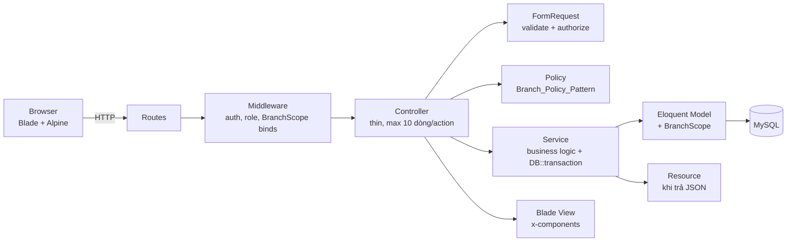
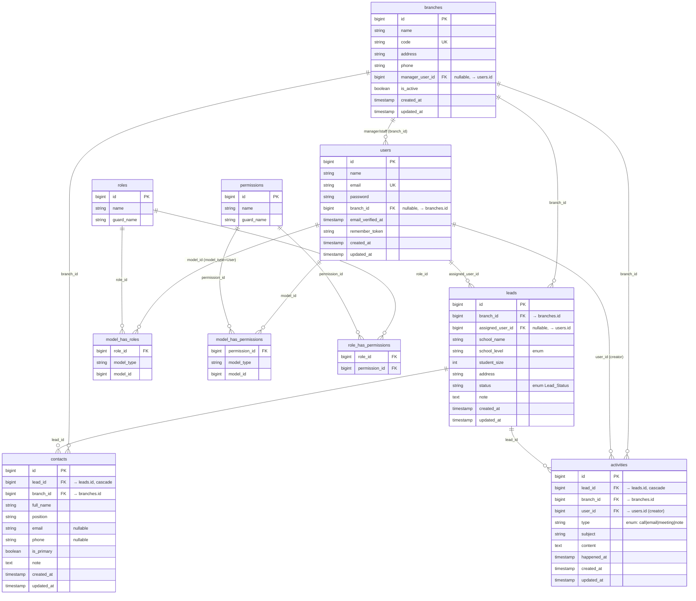

# Design Document — CRM Inter-Edu

## Overview

Tài liệu này mô tả thiết kế kỹ thuật chi tiết cho MVP v1 của CRM Inter-Edu, bám sát `requirements.md` và baseline workspace (Laravel 12, Tailwind 4 qua `@tailwindcss/vite`, Vite 7, PHPUnit 11.5). Phần mô tả viết bằng tiếng Việt, các định danh kỹ thuật giữ nguyên tiếng Anh để khớp với mã nguồn.

Nguyên tắc thiết kế chủ đạo:

- Kiến trúc layered đơn giản: **Routes → Controller (mỏng) → FormRequest → Service → Eloquent Model**, kèm **Policy** cho phân quyền.
- Multi-tenant theo branch dựa trên hai cơ chế song song: **BranchScope** (lọc query) và **Branch_Policy_Pattern** (kiểm tra quyền), đảm bảo defense-in-depth.
- UI dùng **Blade + Alpine.js + Tailwind 4**, không Livewire/Inertia/Filament.
- **Branch_Module** là **Sample_Module** — toàn bộ module nghiệp vụ sau đều copy cấu trúc của module này.

## Architecture

### Layered Architecture



Trách nhiệm từng lớp:

| Lớp | Trách nhiệm | Cấm |
|---|---|---|
| Routes | Khai báo URL → Controller@action, áp middleware `auth`, `verified`, `role:...` | Logic |
| Controller | Nhận FormRequest, gọi `authorize`, gọi Service, trả view/redirect | Validate, query DB trực tiếp, business logic |
| FormRequest | `rules()`, `authorize()`, `prepareForValidation()`, `messages()` | Gọi DB write, gọi Service |
| Service | Business logic, transactions, gọi nhiều Model, set `branch_id` từ auth context | Truy cập `request()`, render view |
| Policy | `viewAny`, `view`, `create`, `update`, `delete` theo Branch_Policy_Pattern | Đọc input, gọi Service |
| Model | Quan hệ, casts, scope, accessor/mutator | Business logic phức tạp |
| Resource | Format output JSON (chỉ dùng khi có API) | Logic |

Quy ước thực thi cứng:

- **Controller mỏng**: mỗi action ≤ 10 dòng, không có `if` business logic.
- **Service không phụ thuộc HTTP**: nhận DTO/array đã validate, không đọc `request()`.
- **Không Repository, không Action class** — Service là điểm tập trung duy nhất của business logic.
- **Transactions**: tất cả thao tác ghi liên quan nhiều bảng phải được bọc trong `DB::transaction()` ở Service.

### Stack & Dependencies

| Tầng | Công nghệ |
|---|---|
| Backend | Laravel 12, PHP 8.2 |
| Auth | Laravel built-in (manual scaffolding, không Breeze/Jetstream) |
| RBAC | `spatie/laravel-permission` |
| DB | MySQL 8.x |
| Frontend | Blade + Alpine.js 3 + Tailwind CSS 4 (`@tailwindcss/vite`) |
| Build | Vite 7 |
| Test | PHPUnit 11.5, `RefreshDatabase` |

## Folder & File Structure Convention

Mọi module nghiệp vụ tuân theo tree sau (ví dụ với `{Module} = Branch`, `{module} = branch`, `{modules} = branches`):

```
app/
├── Http/
│   ├── Controllers/
│   │   ├── Auth/
│   │   │   ├── LoginController.php
│   │   │   ├── LogoutController.php
│   │   │   ├── ForgotPasswordController.php
│   │   │   └── ResetPasswordController.php
│   │   ├── DashboardController.php
│   │   ├── BranchController.php
│   │   ├── UserController.php
│   │   ├── LeadController.php
│   │   ├── ContactController.php
│   │   └── ActivityController.php
│   ├── Requests/
│   │   ├── Branch/
│   │   │   ├── StoreBranchRequest.php
│   │   │   └── UpdateBranchRequest.php
│   │   ├── User/
│   │   │   ├── StoreUserRequest.php
│   │   │   └── UpdateUserRequest.php
│   │   ├── Lead/
│   │   ├── Contact/
│   │   └── Activity/
│   └── Resources/                        # chỉ tạo khi có API
│       └── BranchResource.php
├── Models/
│   ├── Scopes/
│   │   └── BranchScope.php
│   ├── Concerns/
│   │   └── BelongsToBranch.php           # trait optional
│   ├── User.php
│   ├── Branch.php
│   ├── Lead.php
│   ├── Contact.php
│   └── Activity.php
├── Policies/
│   ├── Concerns/
│   │   └── ChecksBranchOwnership.php     # trait dùng trong các Policy
│   ├── BranchPolicy.php
│   ├── UserPolicy.php
│   ├── LeadPolicy.php
│   ├── ContactPolicy.php
│   └── ActivityPolicy.php
├── Services/
│   ├── BranchService.php
│   ├── UserService.php
│   ├── LeadService.php
│   ├── ContactService.php
│   ├── ActivityService.php
│   └── DashboardService.php
└── Providers/
    ├── AppServiceProvider.php
    └── AuthServiceProvider.php           # đăng ký policies

database/
├── factories/
│   ├── BranchFactory.php
│   ├── LeadFactory.php
│   ├── ContactFactory.php
│   └── ActivityFactory.php
├── migrations/
│   ├── 2025_01_01_000001_create_branches_table.php
│   ├── 2025_01_01_000002_add_branch_id_to_users_table.php
│   ├── 2025_01_01_000003_create_permission_tables.php   # spatie publish
│   ├── 2025_01_01_000004_create_leads_table.php
│   ├── 2025_01_01_000005_create_contacts_table.php
│   └── 2025_01_01_000006_create_activities_table.php
└── seeders/
    ├── DatabaseSeeder.php
    ├── RolePermissionSeeder.php
    ├── SuperAdminSeeder.php
    ├── BranchSeeder.php
    ├── LeadSeeder.php
    ├── ContactSeeder.php
    └── ActivitySeeder.php

resources/
├── css/app.css
├── js/
│   ├── app.js                            # import Alpine
│   └── bootstrap.js
└── views/
    ├── layouts/
    │   └── app.blade.php                 # sidebar + topbar + main
    ├── components/
    │   ├── button.blade.php
    │   ├── input.blade.php
    │   ├── modal.blade.php
    │   ├── table.blade.php
    │   ├── badge.blade.php
    │   ├── alert.blade.php
    │   ├── sidebar.blade.php
    │   └── topbar.blade.php
    ├── auth/
    │   ├── login.blade.php
    │   ├── forgot-password.blade.php
    │   └── reset-password.blade.php
    ├── dashboard/
    │   └── index.blade.php
    ├── branches/
    │   ├── index.blade.php
    │   ├── create.blade.php
    │   ├── edit.blade.php
    │   └── show.blade.php
    ├── users/...
    ├── leads/...
    ├── contacts/...
    └── activities/...

routes/
├── web.php
└── auth.php                              # tách routes auth

tests/
├── Feature/
│   ├── Auth/
│   │   ├── LoginTest.php
│   │   ├── LogoutTest.php
│   │   └── ForgotPasswordTest.php
│   ├── BranchTest.php
│   ├── UserTest.php
│   ├── LeadTest.php
│   ├── ContactTest.php
│   ├── ActivityTest.php
│   ├── DashboardTest.php
│   └── BranchScopeTest.php
└── Unit/
    ├── BranchServiceTest.php
    ├── LeadServiceTest.php
    ├── ContactServiceTest.php
    └── ActivityServiceTest.php

CODING_RULES.md                            # nằm ở root
```

## Database ERD



Lưu ý FK:

- `users.branch_id` nullable (super-admin có thể null) — ON DELETE SET NULL.
- `branches.manager_user_id` nullable — ON DELETE SET NULL (xóa user thì branch mất manager).
- `leads.branch_id` NOT NULL — ON DELETE RESTRICT (không cho xóa branch còn lead).
- `contacts.lead_id`, `activities.lead_id` — ON DELETE CASCADE.
- `contacts.branch_id`, `activities.branch_id` — denormalized từ Lead, NOT NULL, ON DELETE RESTRICT.

## Multi-tenant Data Isolation Design

### BranchScope

`BranchScope` là Eloquent global scope tự động thêm `WHERE branch_id = ?` vào mọi query của các model business, trừ super-admin.

```php
<?php

namespace App\Models\Scopes;

use Illuminate\Database\Eloquent\Builder;
use Illuminate\Database\Eloquent\Model;
use Illuminate\Database\Eloquent\Scope;
use Illuminate\Support\Facades\Auth;

class BranchScope implements Scope
{
    public function apply(Builder $builder, Model $model): void
    {
        $user = Auth::user();

        // Guest (CLI seed, queue worker, request chưa auth) → không filter
        if (! $user) {
            return;
        }

        // Super-admin bypass
        if ($user->hasRole('super-admin')) {
            return;
        }

        // User chưa có branch (data sai) → không trả gì
        if ($user->branch_id === null) {
            $builder->whereRaw('1 = 0');
            return;
        }

        $builder->where($model->qualifyColumn('branch_id'), $user->branch_id);
    }
}
```

Áp dụng vào model qua `static::booted()`:

```php
class Lead extends Model
{
    protected static function booted(): void
    {
        static::addGlobalScope(new BranchScope);
    }
}
```

Áp dụng cho: `Lead`, `Contact`, `Activity`. **Không** áp dụng cho `Branch` (vì `Branch` chính là tenant) và **không** áp dụng cho `User` (super-admin cần xem mọi user; với non-super-admin việc xem `User` chặn ở Policy).

### Service-layer branch_id Injection

Service luôn set `branch_id` từ auth context hoặc parent entity, **không bao giờ** lấy từ input người dùng:

```php
class LeadService
{
    public function create(array $data): Lead
    {
        // branch_id LUÔN từ auth, kể cả nếu input có gửi lên
        $data['branch_id'] = Auth::user()->branch_id;
        return Lead::create($data);
    }
}

class ContactService
{
    public function create(Lead $lead, array $data): Contact
    {
        // branch_id thừa kế từ Lead cha
        $data['branch_id'] = $lead->branch_id;
        $data['lead_id']   = $lead->id;
        return Contact::create($data);
    }
}
```

FormRequest **không** cho `branch_id` vào `rules()` để Laravel auto-strip. Nếu attacker gửi `branch_id` trong body, FormRequest reject (extra field) hoặc Service overwrite trước khi insert.

### Cross-branch Access

Luồng truy cập một bản ghi qua route param `/leads/{lead}`:

1. Route model binding chạy `Lead::findOrFail($id)` — BranchScope đã lọc → user khác branch nhận **404**.
2. Sau đó Controller gọi `$this->authorize('view', $lead)` — Policy kiểm tra → nếu vẫn fail (ví dụ sales xem lead không phải của mình trong cùng branch) trả **403**.

Không có thông tin nào tiết lộ sự tồn tại của bản ghi.

## Branch_Policy_Pattern Design

Trait `ChecksBranchOwnership` cung cấp helper dùng chung:

```php
<?php

namespace App\Policies\Concerns;

use App\Models\User;
use Illuminate\Database\Eloquent\Model;

trait ChecksBranchOwnership
{
    /** Super-admin bypass tự động qua before(). */
    public function before(User $user, string $ability): ?bool
    {
        return $user->hasRole('super-admin') ? true : null;
    }

    protected function sameBranch(User $user, Model $model): bool
    {
        return $user->branch_id !== null
            && (int) $user->branch_id === (int) $model->branch_id;
    }
}
```

`LeadPolicy` mẫu áp dụng pattern:

```php
<?php

namespace App\Policies;

use App\Models\Lead;
use App\Models\User;
use App\Policies\Concerns\ChecksBranchOwnership;

class LeadPolicy
{
    use ChecksBranchOwnership;

    public function viewAny(User $user): bool
    {
        return $user->hasAnyRole(['branch-manager', 'sales']);
    }

    public function view(User $user, Lead $lead): bool
    {
        if (! $this->sameBranch($user, $lead)) {
            return false;
        }
        if ($user->hasRole('sales')) {
            return $lead->assigned_user_id === $user->id;
        }
        return $user->hasRole('branch-manager');
    }

    public function create(User $user): bool
    {
        return $user->hasAnyRole(['branch-manager', 'sales']);
    }

    public function update(User $user, Lead $lead): bool
    {
        return $this->view($user, $lead);
    }

    public function delete(User $user, Lead $lead): bool
    {
        // chỉ branch-manager xóa được, sales không
        return $this->sameBranch($user, $lead) && $user->hasRole('branch-manager');
    }

    public function assign(User $user, Lead $lead): bool
    {
        return $this->sameBranch($user, $lead) && $user->hasRole('branch-manager');
    }
}
```

`before()` đảm bảo super-admin tự động pass mọi ability mà không cần lặp lại check trong từng method.

## Roles & Permissions Design

### Role list

| Role | Mô tả |
|---|---|
| `super-admin` | Toàn quyền, không gắn branch |
| `branch-manager` | Quản lý 1 branch, toàn quyền trong branch đó |
| `sales` | Nhân viên kinh doanh, chỉ thao tác lead được assign |

### Permission list

Dùng coarse-grained permissions ở mức module để giữ đơn giản; chi tiết phân quyền (sales vs manager) xử lý trong Policy.

| Permission | super-admin | branch-manager | sales |
|---|---|---|---|
| `manage-users` | ✅ | ❌ | ❌ |
| `manage-branches` | ✅ | ❌ | ❌ |
| `view-branches` | ✅ | ✅ | ✅ |
| `manage-leads` | ✅ | ✅ | ✅ (Policy giới hạn assigned) |
| `manage-contacts` | ✅ | ✅ | ✅ (Policy giới hạn theo lead) |
| `manage-activities` | ✅ | ✅ | ✅ (Policy giới hạn theo lead) |
| `view-dashboard` | ✅ | ✅ | ✅ |

### Seeder Strategy

```php
class RolePermissionSeeder extends Seeder
{
    public function run(): void
    {
        $permissions = [
            'manage-users', 'manage-branches', 'view-branches',
            'manage-leads', 'manage-contacts', 'manage-activities',
            'view-dashboard',
        ];
        foreach ($permissions as $p) {
            Permission::firstOrCreate(['name' => $p, 'guard_name' => 'web']);
        }

        $superAdmin = Role::firstOrCreate(['name' => 'super-admin']);
        $superAdmin->syncPermissions($permissions);

        $manager = Role::firstOrCreate(['name' => 'branch-manager']);
        $manager->syncPermissions([
            'view-branches', 'manage-leads', 'manage-contacts',
            'manage-activities', 'view-dashboard',
        ]);

        $sales = Role::firstOrCreate(['name' => 'sales']);
        $sales->syncPermissions([
            'view-branches', 'manage-leads', 'manage-contacts',
            'manage-activities', 'view-dashboard',
        ]);
    }
}

class SuperAdminSeeder extends Seeder
{
    public function run(): void
    {
        $user = User::firstOrCreate(
            ['email' => 'admin@inter-edu.local'],
            [
                'name'      => 'Super Admin',
                'password'  => Hash::make('password'),
                'branch_id' => null,
            ],
        );
        $user->assignRole('super-admin');
    }
}
```

`DatabaseSeeder` gọi theo thứ tự: `RolePermissionSeeder` → `BranchSeeder` → `SuperAdminSeeder` → `LeadSeeder` → `ContactSeeder` → `ActivitySeeder`.


## Module Reference Design — Branches (Sample Module)

`Branch_Module` là **Sample_Module**. Mọi module nghiệp vụ về sau **bắt buộc** copy cấu trúc này.

### Migration

```php
// database/migrations/2025_01_01_000001_create_branches_table.php
return new class extends Migration {
    public function up(): void
    {
        Schema::create('branches', function (Blueprint $table) {
            $table->id();
            $table->string('name');
            $table->string('code')->unique();
            $table->string('address')->nullable();
            $table->string('phone')->nullable();
            $table->foreignId('manager_user_id')
                  ->nullable()
                  ->constrained('users')
                  ->nullOnDelete();
            $table->boolean('is_active')->default(true);
            $table->timestamps();
            $table->index(['is_active']);
        });
    }
};
```

`users.branch_id` được thêm bằng migration riêng (sau khi `branches` đã tồn tại):

```php
// 2025_01_01_000002_add_branch_id_to_users_table.php
Schema::table('users', function (Blueprint $table) {
    $table->foreignId('branch_id')->nullable()->after('id')
          ->constrained('branches')->nullOnDelete();
});
```

### Model

```php
<?php

namespace App\Models;

use Illuminate\Database\Eloquent\Factories\HasFactory;
use Illuminate\Database\Eloquent\Model;
use Illuminate\Database\Eloquent\Relations\BelongsTo;
use Illuminate\Database\Eloquent\Relations\HasMany;

class Branch extends Model
{
    use HasFactory;

    protected $fillable = [
        'name', 'code', 'address', 'phone', 'manager_user_id', 'is_active',
    ];

    protected $casts = [
        'is_active' => 'boolean',
    ];

    // KHÔNG có BranchScope: Branch CHÍNH LÀ tenant.

    public function manager(): BelongsTo
    {
        return $this->belongsTo(User::class, 'manager_user_id');
    }

    public function users(): HasMany
    {
        return $this->hasMany(User::class);
    }

    public function leads(): HasMany
    {
        return $this->hasMany(Lead::class);
    }
}
```

### FormRequests

```php
// app/Http/Requests/Branch/StoreBranchRequest.php
class StoreBranchRequest extends FormRequest
{
    public function authorize(): bool
    {
        return $this->user()->can('create', Branch::class);
    }

    public function rules(): array
    {
        return [
            'name'            => ['required', 'string', 'max:255'],
            'code'            => ['required', 'string', 'max:50', 'unique:branches,code'],
            'address'         => ['nullable', 'string', 'max:500'],
            'phone'           => ['nullable', 'string', 'max:50'],
            'manager_user_id' => ['nullable', 'integer', 'exists:users,id'],
            'is_active'       => ['boolean'],
        ];
    }
}

// app/Http/Requests/Branch/UpdateBranchRequest.php
class UpdateBranchRequest extends FormRequest
{
    public function authorize(): bool
    {
        return $this->user()->can('update', $this->route('branch'));
    }

    public function rules(): array
    {
        $branchId = $this->route('branch')->id;
        return [
            'name'            => ['required', 'string', 'max:255'],
            'code'            => ['required', 'string', 'max:50',
                                  Rule::unique('branches', 'code')->ignore($branchId)],
            'address'         => ['nullable', 'string', 'max:500'],
            'phone'           => ['nullable', 'string', 'max:50'],
            'manager_user_id' => ['nullable', 'integer', 'exists:users,id'],
            'is_active'       => ['boolean'],
        ];
    }
}
```

### Service

```php
<?php

namespace App\Services;

use App\Exceptions\BranchHasDependenciesException;
use App\Models\Branch;
use Illuminate\Contracts\Pagination\LengthAwarePaginator;
use Illuminate\Support\Facades\DB;

class BranchService
{
    public function list(array $filters = []): LengthAwarePaginator
    {
        return Branch::query()
            ->when($filters['is_active'] ?? null, fn ($q, $v) => $q->where('is_active', $v))
            ->when($filters['q'] ?? null, fn ($q, $v) =>
                $q->where(fn ($q2) => $q2->where('name', 'like', "%{$v}%")
                                         ->orWhere('code', 'like', "%{$v}%")))
            ->orderBy('name')
            ->paginate(20);
    }

    public function create(array $data): Branch
    {
        return DB::transaction(fn () => Branch::create($data));
    }

    public function update(Branch $branch, array $data): Branch
    {
        return DB::transaction(function () use ($branch, $data) {
            $branch->update($data);
            return $branch->fresh();
        });
    }

    public function delete(Branch $branch): void
    {
        DB::transaction(function () use ($branch) {
            if ($branch->users()->exists() || $branch->leads()->exists()) {
                throw new BranchHasDependenciesException(
                    'Không thể xóa branch đang có user hoặc lead liên kết.'
                );
            }
            $branch->delete();
        });
    }
}
```

### Policy

```php
class BranchPolicy
{
    use ChecksBranchOwnership; // before() → super-admin bypass

    public function viewAny(User $user): bool
    {
        return true;
    }

    public function view(User $user, Branch $branch): bool
    {
        return $user->branch_id === $branch->id;
    }

    public function create(User $user): bool
    {
        return false; // chỉ super-admin (qua before)
    }

    public function update(User $user, Branch $branch): bool
    {
        return false;
    }

    public function delete(User $user, Branch $branch): bool
    {
        return false;
    }
}
```

### Controller

```php
class BranchController extends Controller
{
    public function __construct(private BranchService $service) {}

    public function index(Request $request)
    {
        $this->authorize('viewAny', Branch::class);
        $branches = $this->service->list($request->only(['is_active', 'q']));
        return view('branches.index', compact('branches'));
    }

    public function create()
    {
        $this->authorize('create', Branch::class);
        return view('branches.create');
    }

    public function store(StoreBranchRequest $request)
    {
        $branch = $this->service->create($request->validated());
        return redirect()->route('branches.show', $branch)->with('success', 'Đã tạo branch.');
    }

    public function show(Branch $branch)
    {
        $this->authorize('view', $branch);
        return view('branches.show', compact('branch'));
    }

    public function edit(Branch $branch)
    {
        $this->authorize('update', $branch);
        return view('branches.edit', compact('branch'));
    }

    public function update(UpdateBranchRequest $request, Branch $branch)
    {
        $this->service->update($branch, $request->validated());
        return redirect()->route('branches.show', $branch)->with('success', 'Đã cập nhật.');
    }

    public function destroy(Branch $branch)
    {
        $this->authorize('delete', $branch);
        try {
            $this->service->delete($branch);
        } catch (BranchHasDependenciesException $e) {
            return back()->with('error', $e->getMessage());
        }
        return redirect()->route('branches.index')->with('success', 'Đã xóa branch.');
    }
}
```

### Routes

```php
// routes/web.php
Route::middleware(['auth'])->group(function () {
    Route::get('/dashboard', [DashboardController::class, 'index'])->name('dashboard');

    Route::resource('branches', BranchController::class);
    Route::resource('users', UserController::class);
    Route::resource('leads', LeadController::class);
    Route::resource('leads.contacts', ContactController::class)->shallow();
    Route::resource('leads.activities', ActivityController::class)->shallow();
});
```

### Blade Views (skeleton)

```blade
{{-- resources/views/branches/index.blade.php --}}
<x-layouts.app title="Branches">
    @can('create', App\Models\Branch::class)
        <a href="{{ route('branches.create') }}">
            <x-button variant="primary">+ Thêm branch</x-button>
        </a>
    @endcan

    <x-table :headers="['Code', 'Name', 'Manager', 'Active', '']">
        @foreach ($branches as $branch)
            <tr>
                <td>{{ $branch->code }}</td>
                <td>{{ $branch->name }}</td>
                <td>{{ $branch->manager?->name ?? '—' }}</td>
                <td>
                    <x-badge :variant="$branch->is_active ? 'success' : 'secondary'">
                        {{ $branch->is_active ? 'Active' : 'Inactive' }}
                    </x-badge>
                </td>
                <td>
                    <a href="{{ route('branches.show', $branch) }}">Xem</a>
                </td>
            </tr>
        @endforeach
    </x-table>

    {{ $branches->links() }}
</x-layouts.app>
```

```blade
{{-- resources/views/branches/create.blade.php --}}
<x-layouts.app title="Tạo branch">
    <form method="POST" action="{{ route('branches.store') }}">
        @csrf
        <x-input name="name" label="Tên branch" required />
        <x-input name="code" label="Mã branch" required />
        <x-input name="address" label="Địa chỉ" />
        <x-input name="phone" label="Số điện thoại" />
        <x-button type="submit" variant="primary">Lưu</x-button>
    </form>
</x-layouts.app>
```

### Factory + Seeder

```php
class BranchFactory extends Factory
{
    public function definition(): array
    {
        return [
            'name'      => $this->faker->company().' Campus',
            'code'      => strtoupper($this->faker->unique()->bothify('BR-####')),
            'address'   => $this->faker->address(),
            'phone'     => $this->faker->phoneNumber(),
            'is_active' => true,
        ];
    }
}

class BranchSeeder extends Seeder
{
    public function run(): void
    {
        Branch::factory()->count(3)->create();
    }
}
```

## Other Modules — Concise Design

### Users Module

- Bảng: `users` (Laravel default + thêm `branch_id` nullable).
- Quan hệ: `belongsTo(Branch)`, role qua Spatie.
- Policy: `UserPolicy` — chỉ `super-admin` `viewAny/create/update/delete`.
- BranchScope: **không** áp dụng cho User.
- Validation đặc thù: `branch_id` required nếu role ∈ {`branch-manager`, `sales`}, nullable nếu `super-admin`.
- FormRequest dùng `Rule::requiredIf` dựa trên `role` trong input.

### Leads Module

- Fields: như ERD. Enum `school_level`, `status` (xem section enum).
- BranchScope: **áp dụng**.
- Policy: `LeadPolicy` (đã mô tả ở Branch_Policy_Pattern).
- Service đặc thù:
  - `LeadService::create()` set `branch_id` từ `auth()->user()->branch_id`.
  - `LeadService::assign(Lead $lead, ?int $userId)`: validate `userId === null` hoặc User có cùng `branch_id` với `$lead`, trả lỗi nếu không.
- Filter `branch_id` chỉ super-admin được dùng (Controller check `$user->hasRole('super-admin')` trước khi truyền vào Service).

### Contacts Module

- Fields: như ERD.
- BranchScope: **áp dụng**.
- Policy: `ContactPolicy` — view/update/delete đều check Lead cha qua `$contact->lead`, và áp dụng cùng quy tắc Lead Policy.
- Service đặc thù:
  - `ContactService::create(Lead $lead, array $data)`: set `lead_id` và `branch_id` từ Lead.
  - `ContactService::setPrimary(Contact $contact)`: trong transaction, `Contact::where('lead_id', $contact->lead_id)->update(['is_primary' => false])` rồi `$contact->update(['is_primary' => true])` — đảm bảo chỉ một primary per Lead.
  - Nếu input `is_primary === true` ở `create` hoặc `update`, gọi `setPrimary()`.
- Validation: `email` hoặc `phone` phải có ít nhất một (`required_without` cross-rule).
- Cascade delete tự động qua FK `ON DELETE CASCADE`.

### Activities Module

- Fields: như ERD. Enum `type ∈ {call, email, meeting, note}`.
- BranchScope: **áp dụng**.
- Policy: `ActivityPolicy` — kế thừa quyền theo Lead cha (giống Contact).
- Service đặc thù:
  - `ActivityService::create(Lead $lead, array $data)`:
    - `$data['user_id'] = auth()->id()`
    - `$data['branch_id'] = $lead->branch_id`
    - `$data['lead_id']   = $lead->id`
- Listing trong Lead detail: `$lead->activities()->orderByDesc('happened_at')->get()`.
- Validation: `type` dùng `Rule::in(['call', 'email', 'meeting', 'note'])`.

## Enum Definitions

### `Lead_Status`

```php
enum LeadStatus: string
{
    case New         = 'new';
    case Contacted   = 'contacted';
    case Qualified   = 'qualified';
    case Proposal    = 'proposal';
    case Negotiation = 'negotiation';
    case Won         = 'won';
    case Lost        = 'lost';
}
```

Thứ tự pipeline mặc định: `new → contacted → qualified → proposal → negotiation → won|lost`. Không enforce transition cứng ở v1.

### `School_Level`

```php
enum SchoolLevel: string
{
    case MamNon  = 'mam_non';      // Mầm non
    case TieuHoc = 'tieu_hoc';     // Tiểu học
    case THCS    = 'thcs';
    case THPT    = 'thpt';
    case LienCap = 'lien_cap';     // Liên cấp
    case Khac    = 'khac';
}
```

### `Activity_Type`

```php
enum ActivityType: string
{
    case Call    = 'call';
    case Email   = 'email';
    case Meeting = 'meeting';
    case Note    = 'note';
}
```

Casting trong Model: `protected $casts = ['status' => LeadStatus::class, 'school_level' => SchoolLevel::class, 'type' => ActivityType::class];`. Lưu trữ trong DB là `string` (không dùng MySQL `ENUM` để dễ migrate enum mới).

## Authentication Design

Không dùng Breeze/Jetstream. Auth scaffolding viết tay để giữ stack lean.

### Routes (`routes/auth.php`)

```php
Route::middleware('guest')->group(function () {
    Route::get('/login', [LoginController::class, 'show'])->name('login');
    Route::post('/login', [LoginController::class, 'store']);

    Route::get('/forgot-password', [ForgotPasswordController::class, 'show'])->name('password.request');
    Route::post('/forgot-password', [ForgotPasswordController::class, 'store'])->name('password.email');

    Route::get('/reset-password/{token}', [ResetPasswordController::class, 'show'])->name('password.reset');
    Route::post('/reset-password', [ResetPasswordController::class, 'store'])->name('password.update');
});

Route::post('/logout', [LogoutController::class, 'destroy'])
    ->middleware('auth')->name('logout');
```

### Controllers (skeleton)

```php
class LoginController extends Controller
{
    public function show()
    {
        return view('auth.login');
    }

    public function store(LoginRequest $request)
    {
        $request->authenticate();
        $request->session()->regenerate();
        return redirect()->intended(route('dashboard'));
    }
}

class ForgotPasswordController extends Controller
{
    public function store(Request $request)
    {
        $request->validate(['email' => ['required', 'email']]);
        // Password::sendResetLink trả về cùng status cho email tồn tại / không
        // → đảm bảo neutral response (no information disclosure)
        Password::sendResetLink($request->only('email'));
        return back()->with('status', __('Nếu email tồn tại, link đặt lại mật khẩu đã được gửi.'));
    }
}
```

`LoginRequest` có method `authenticate()` gọi `Auth::attempt()`, throttle 5 attempts/phút theo email.

Default redirect sau login: `route('dashboard')` = `/dashboard`. Forgot password dùng `Password` facade (Laravel password broker).

### Blade Views

`resources/views/auth/login.blade.php`, `forgot-password.blade.php`, `reset-password.blade.php` — dùng layout đơn giản (không sidebar/topbar) `layouts.guest.blade.php`.

## UI Component Library Design

### Layout `layouts.app`

```blade
{{-- resources/views/layouts/app.blade.php --}}
<!DOCTYPE html>
<html lang="vi">
<head>
    <meta charset="UTF-8">
    <meta name="viewport" content="width=device-width, initial-scale=1.0">
    <title>{{ $title ?? 'CRM Inter-Edu' }}</title>
    @vite(['resources/css/app.css', 'resources/js/app.js'])
</head>
<body class="bg-gray-50 text-gray-900" x-data="{ sidebarOpen: false }">
    <div class="flex min-h-screen">
        <x-sidebar :open="'sidebarOpen'" />
        <div class="flex-1 flex flex-col">
            <x-topbar @toggle-sidebar="sidebarOpen = !sidebarOpen" />
            <main class="flex-1 p-6">
                @if (session('success'))
                    <x-alert type="success" dismissible>{{ session('success') }}</x-alert>
                @endif
                @if (session('error'))
                    <x-alert type="error" dismissible>{{ session('error') }}</x-alert>
                @endif
                {{ $slot }}
            </main>
        </div>
    </div>
</body>
</html>
```

### Component Prop Interface

| Component | Props | Slot | Alpine |
|---|---|---|---|
| `x-button` | `variant` (`primary`/`secondary`/`danger`), `type` (default `button`), `disabled` (bool) | label | – |
| `x-input` | `name`, `label`, `type` (default `text`), `required` (bool), `value`, `error` (auto từ `$errors`) | – | – |
| `x-modal` | `id` (string), `title` | body slot | `x-data="{ open: false }"` toggle qua `@modalId` event |
| `x-table` | `headers` (array<string>) | rows slot (`<tr>...`) | – |
| `x-badge` | `variant` (`primary`/`success`/`warning`/`danger`/`secondary`) | text | – |
| `x-alert` | `type` (`success`/`error`/`warning`/`info`), `dismissible` (bool) | message | `x-data="{ show: true }"` cho dismiss |
| `x-sidebar` | `open` (Alpine binding) | – | mobile toggle |
| `x-topbar` | – | – | dropdown user menu |

### Color Mapping (Tailwind 4)

| Variant | Background | Text | Border |
|---|---|---|---|
| `success` | `bg-green-50` | `text-green-800` | `border-green-200` |
| `error` / `danger` | `bg-red-50` | `text-red-800` | `border-red-200` |
| `warning` | `bg-yellow-50` | `text-yellow-800` | `border-yellow-200` |
| `info` | `bg-blue-50` | `text-blue-800` | `border-blue-200` |
| `primary` | `bg-indigo-600` | `text-white` | – |
| `secondary` | `bg-gray-100` | `text-gray-800` | `border-gray-200` |

### Alpine.js Patterns

```html
<!-- Modal toggle -->
<div x-data="{ open: false }">
    <button @click="open = true">Mở</button>
    <div x-show="open" @click.outside="open = false">...</div>
</div>

<!-- User menu dropdown trên topbar -->
<div x-data="{ menuOpen: false }">
    <button @click="menuOpen = !menuOpen">{{ auth()->user()->name }}</button>
    <div x-show="menuOpen" @click.outside="menuOpen = false">...</div>
</div>

<!-- Mobile sidebar toggle -->
<button @click="sidebarOpen = !sidebarOpen" class="md:hidden">☰</button>
<aside :class="{ 'translate-x-0': sidebarOpen, '-translate-x-full': !sidebarOpen }"
       class="md:translate-x-0 transition">...</aside>

<!-- Toast auto-dismiss -->
<div x-data="{ show: true }" x-init="setTimeout(() => show = false, 4000)" x-show="show">...</div>
```

### Sidebar Role-aware Nav

```blade
@can('manage-branches')
    <a href="{{ route('branches.index') }}">Branches</a>
@endcan
@can('manage-users')
    <a href="{{ route('users.index') }}">Users</a>
@endcan
<a href="{{ route('leads.index') }}">Leads</a>
<a href="{{ route('dashboard') }}">Dashboard</a>
```

Topbar hiển thị `auth()->user()->name`, role primary, branch (nếu có), nút logout (`<form method="POST" action="{{ route('logout') }}">`).


## CODING_RULES.md Outline

File `CODING_RULES.md` ở thư mục gốc là single source of truth về quy ước code. Cấu trúc:

```markdown
# CODING_RULES.md

## 1. Architecture
- Controller mỏng → FormRequest → Service → Eloquent Model.
- Policy đăng ký trong AuthServiceProvider, gọi qua $this->authorize() trong Controller.
- KHÔNG dùng Repository pattern. KHÔNG dùng Action class. Service là điểm tập trung business logic.
- Mỗi Controller action ≤ 10 dòng. Mọi business logic phải ở Service.
- Service KHÔNG đọc request() trực tiếp; chỉ nhận array đã validate.

## 2. Naming Conventions
| Loại | Convention | Ví dụ |
|---|---|---|
| Controller | {Module}Controller (singular) | BranchController |
| FormRequest | Store/Update{Module}Request, namespace App\Http\Requests\{Module} | StoreBranchRequest |
| Service | {Module}Service | BranchService |
| Policy | {Module}Policy | BranchPolicy |
| Model | {Module} (singular PascalCase) | Branch |
| Migration | YYYY_MM_DD_NNNNNN_create_{modules}_table.php | create_branches_table |
| Factory | {Module}Factory | BranchFactory |
| Seeder | {Module}Seeder | BranchSeeder |
| View directory | resources/views/{modules}/ (plural snake_case) | branches/ |
| Route name | {modules}.action | branches.index |
| Test class | {Module}Test (Feature), {Module}ServiceTest (Unit) | BranchTest |

## 3. Multi-tenant Rules
- Mọi business table có cột branch_id.
- Lead, Contact, Activity bind BranchScope qua static booted().
- Branch_id trong record LUÔN từ auth context hoặc parent entity, KHÔNG bao giờ từ user input.
- Mọi Policy của business model dùng trait ChecksBranchOwnership.
- Super-admin bypass thông qua Policy::before() và BranchScope check role.

## 4. UI Rules
- Dùng Tailwind 4 qua @tailwindcss/vite, KHÔNG dùng tailwind.config.js.
- Dùng Alpine.js cho client interaction. KHÔNG Livewire/Inertia/Filament.
- Component dùng chung: x-button, x-input, x-modal, x-table, x-badge, x-alert.
- Layout chuẩn: layouts.app (sidebar + topbar + main).
- Mọi form dùng @csrf và x-input để hiển thị error tự động.
- Sidebar nav phải @can dựa trên permission, không hardcode role.

## 5. Testing Rules
- Feature test cho HTTP layer + auth.
- Unit test cho Service classes.
- Dùng RefreshDatabase trait.
- Tên method test: snake_case bắt đầu bằng test_ (ví dụ test_super_admin_can_create_branch).
- Mỗi module có ít nhất feature test bao phủ index/store/update/destroy + authorization cho từng role.
- Dùng factory cho mọi data setup, KHÔNG insert thủ công.

## 6. Git/Commit Rules (optional)
- Branch naming: feature/{module}-{short-desc}, bugfix/{short-desc}.
- Commit message theo conventional: feat(branch): add CRUD, fix(lead): correct policy check.

## 7. Examples
Xem Branch_Module làm reference. Mọi module mới copy cấu trúc này.
```

## Testing Strategy

### Phân loại test

| Loại | Vị trí | Mục đích |
|---|---|---|
| Feature | `tests/Feature/{Module}Test.php` | HTTP layer, auth, authorization, validate end-to-end |
| Unit | `tests/Unit/{Module}ServiceTest.php` | Logic Service tách biệt khỏi HTTP |
| Auth Feature | `tests/Feature/Auth/*Test.php` | Login/logout/forgot/reset password |
| Multi-tenant | `tests/Feature/BranchScopeTest.php` | BranchScope isolation |

### Tooling

- PHPUnit 11.5 (đã có sẵn trong skeleton).
- Trait `RefreshDatabase` cho mọi test class chạm DB.
- Factory bắt buộc cho mọi seed data.
- `actingAs($user)` để set auth context.

### Test Naming

- Method: `test_{subject}_{condition}_{expectation}` ví dụ `test_sales_cannot_view_lead_assigned_to_other_user`.
- Hoặc dùng attribute `#[Test]` của PHPUnit 11.

### Coverage Target

Mỗi module nghiệp vụ phải có:

- Test mỗi action CRUD success path.
- Test authorization cho từng role (super-admin, branch-manager, sales, guest).
- Test validation fail cases quan trọng.
- Test BranchScope isolation (cho Lead/Contact/Activity).

## Dashboard Design

### Controller

```php
class DashboardController extends Controller
{
    public function __construct(private DashboardService $service) {}

    public function index()
    {
        $stats = $this->service->getStatsForUser(auth()->user());
        return view('dashboard.index', compact('stats'));
    }
}
```

### Service

```php
class DashboardService
{
    /**
     * @return array{
     *   total_leads: int,
     *   leads_by_status: array<string,int>,
     *   total_contacts: int,
     *   activities_last_7_days: int,
     *   leads_by_branch?: array<string,int>,  // chỉ super-admin
     * }
     */
    public function getStatsForUser(User $user): array
    {
        // Lead/Contact/Activity model đã có BranchScope auto-filter,
        // nhưng với sales ta cần thêm filter assigned_user_id.
        $leadQuery = Lead::query();
        $activityQuery = Activity::query();
        $contactQuery = Contact::query();

        if ($user->hasRole('sales')) {
            $leadQuery->where('assigned_user_id', $user->id);
            // Activity/Contact giữ scope theo branch (sales vẫn thấy
            // tất cả contacts/activities của lead trong branch nhưng
            // filter ở UI theo lead detail nếu cần).
        }

        $stats = [
            'total_leads'             => (clone $leadQuery)->count(),
            'leads_by_status'         => (clone $leadQuery)
                ->selectRaw('status, count(*) as c')
                ->groupBy('status')
                ->pluck('c', 'status')
                ->toArray(),
            'total_contacts'          => $contactQuery->count(),
            'activities_last_7_days'  => $activityQuery
                ->where('happened_at', '>=', now()->subDays(7))
                ->count(),
        ];

        if ($user->hasRole('super-admin')) {
            $stats['leads_by_branch'] = Lead::withoutGlobalScope(BranchScope::class)
                ->selectRaw('branch_id, count(*) as c')
                ->groupBy('branch_id')
                ->pluck('c', 'branch_id')
                ->toArray();
        }

        return $stats;
    }
}
```

Vì BranchScope đã filter sẵn Lead/Contact/Activity theo branch của user, dashboard tự động đúng phạm vi cho `branch-manager` mà không cần code thêm. Sales cần thêm filter `assigned_user_id`. Super-admin thấy tất cả + chia theo branch.

### View

`resources/views/dashboard/index.blade.php` hiển thị các card:

- Total Leads
- Leads by Status (bar đơn giản hoặc list)
- Total Activities (last 7 days)
- Total Contacts
- Leads by Branch (chỉ super-admin)

Dùng `x-badge` để hiển thị status, không có biểu đồ phức tạp ở v1.

## Implementation Sequencing

Thứ tự bắt buộc, mỗi bước phải hoàn thành trước khi chuyển bước kế:

1. **Foundation**
   1. Cài MySQL config, switch `.env` từ sqlite, gỡ `database/database.sqlite`.
   2. Cài `spatie/laravel-permission` qua Composer, publish migration.
   3. Cài Alpine.js qua npm, import trong `resources/js/app.js`.
   4. Tạo file `CODING_RULES.md` ở root.
2. **Sample Module — Branches**
   1. Migration `branches`, migration `add_branch_id_to_users`.
   2. Model `Branch`, `User` (thêm `branch_id`).
   3. Trait `ChecksBranchOwnership`, `BranchScope` (đặt sẵn nhưng chưa apply ai trừ Lead/Contact/Activity sau này).
   4. `BranchService`, `BranchPolicy`, `StoreBranchRequest`, `UpdateBranchRequest`, `BranchController`.
   5. Factory, seeder, route, blade views (index/create/edit/show).
   6. UI components: layouts.app, x-button, x-input, x-modal, x-table, x-badge, x-alert, x-sidebar, x-topbar.
   7. Feature test `BranchTest`, unit test `BranchServiceTest`.
3. **Authentication**
   1. Routes `routes/auth.php`, controllers, blade views.
   2. Layout `layouts.guest`.
   3. Feature test `LoginTest`, `LogoutTest`, `ForgotPasswordTest`.
4. **Users & Roles**
   1. `RolePermissionSeeder`, `SuperAdminSeeder`.
   2. `UserService`, `UserPolicy`, FormRequests, Controller, views.
   3. Feature test `UserTest`.
5. **Leads**
   1. Migration, Model + BranchScope, enum `LeadStatus`, `SchoolLevel`.
   2. Service (bao gồm `assign`), Policy, FormRequests, Controller, views, factory, seeder.
   3. Feature test `LeadTest`, `BranchScopeTest`.
6. **Contacts**
   1. Migration, Model + BranchScope.
   2. Service (bao gồm `setPrimary` transaction), Policy, FormRequests, Controller (nested route), views, factory, seeder.
   3. Feature test `ContactTest`.
7. **Activities**
   1. Migration, Model + BranchScope, enum `ActivityType`.
   2. Service, Policy, FormRequests, Controller (nested route), views, factory, seeder.
   3. Feature test `ActivityTest`.
8. **Dashboard**
   1. `DashboardService`, `DashboardController`, view.
   2. Feature test `DashboardTest`.

**Lý do**: bước 1+2 thiết lập "vân tay kiến trúc" — sai ở đây sẽ phải sửa ở mọi module sau. Có Branch trước Auth vì User cần `branch_id` FK trỏ về `branches`.

## Open Questions / Non-Goals

### Out of scope cho v1

- **Deals** (cơ hội bán hàng có giá trị): chưa làm, có thể gắn vào Lead ở v2.
- **Tasks** (công việc cần làm): không có module Task riêng; ghi chú dùng Activity type `note`.
- **Reports** chuyên sâu (export PDF/Excel, pivot): không.
- **Import/Export** CSV: không.
- **Email templates** + send mail tới Lead/Contact: không (chỉ có forgot-password mail).
- **Notifications** (in-app, email cho user nội bộ): không.
- **Attachments** / file upload trên Lead/Activity: không.
- **Audit log** chi tiết: không (chỉ có `created_at`/`updated_at` Eloquent mặc định).
- **API endpoints** cho mobile/3rd party: không (Resource layer chuẩn bị sẵn nhưng không expose).
- **Soft deletes**: không ở v1 (delete = hard delete, có refusal-if-linked).
- **Multi-language UI**: chuỗi tiếng Việt hardcode trong Blade là chấp nhận được; i18n không bắt buộc.

### Câu hỏi mở (chưa quyết, cần thống nhất khi implement)

- Lead duplicate detection (cùng `school_name` + `address`): chưa quyết, mặc định cho phép trùng, để v2.
- Quy tắc transition `Lead_Status` (ví dụ không cho từ `lost` về `new`): chưa enforce ở v1, free-form.
- Permission có cần granular hơn (`view-leads` vs `edit-leads`) không: hiện coarse-grained `manage-leads`, nâng cấp khi cần.
- Branch deactivate (set `is_active=false`) khi không xóa được: hiện đã có cờ `is_active`, hành vi cụ thể (ẩn khỏi dropdown, chặn tạo lead mới) chưa rõ.

## Correctness Properties

*A property is a characteristic or behavior that should hold true across all valid executions of a system — essentially, a formal statement about what the system should do. Properties serve as the bridge between human-readable specifications and machine-verifiable correctness guarantees.*

### Property 1: BranchScope tự động cô lập dữ liệu theo branch

*For any* tập hợp bản ghi `Lead`, `Contact`, `Activity` thuộc nhiều branch khác nhau, và *for any* user đã đăng nhập, kết quả của bất kỳ truy vấn `Model::query()` nào (không có `withoutGlobalScope`) chỉ chứa các bản ghi thỏa: user có role `super-admin` (trả về tất cả), hoặc `record.branch_id === user.branch_id`. User có `branch_id === null` và không phải `super-admin` không thấy bản ghi nào.

**Validates: Requirements 6.2, 10.2, 10.3, 10.4, 10.5**

### Property 2: Branch_Policy_Pattern đồng nhất trên mọi business model

*For any* user `U` và *for any* business model instance `M` (`Lead`, `Contact`, `Activity`, `Branch`), Policy authorization (`view`, `update`, `delete`) trả về `true` chỉ khi: `U` có role `super-admin`, hoặc (`U.branch_id === M.branch_id` và role-specific constraint thỏa). Mọi trường hợp khác Policy trả `false`.

**Validates: Requirements 5.4, 5.5, 6.4, 6.6, 6.7, 7.5, 8.5, 10.6**

### Property 3: Sales chỉ thao tác lead được assign cho mình

*For any* user `U` có role `sales` và *for any* lead `L` cùng branch với `U`, Policy `view`/`update` cho `L` trả về `true` khi và chỉ khi `L.assigned_user_id === U.id`.

**Validates: Requirements 6.5**

### Property 4: Service-layer luôn set branch_id từ context, không từ input

*For any* `Lead` được tạo qua `LeadService::create($data)`, bất kể `$data` chứa `branch_id` nào, bản ghi kết quả có `branch_id === auth()->user()->branch_id`. *For any* `Contact` hoặc `Activity` được tạo qua Service từ một Lead `L`, bản ghi kết quả có `branch_id === L.branch_id`.

**Validates: Requirements 7.3, 8.3, 8.6, 10.7**

### Property 5: Cross-branch resource access không tiết lộ thông tin

*For any* user `U` và *for any* bản ghi `R` (Lead/Contact/Activity) thuộc branch khác `U.branch_id` (và `U` không phải `super-admin`), HTTP request `GET /resource/{R.id}` trả về status code 404 hoặc 403, không bao giờ 200, và response body không chứa dữ liệu của `R`.

**Validates: Requirements 10.8**

### Property 6: Branch code uniqueness

*For any* branch tồn tại với `code = C`, mọi nỗ lực tạo branch mới với `code = C` (qua `StoreBranchRequest`) đều fail validate (HTTP 422), và số branch trong DB không tăng.

**Validates: Requirements 5.6**

### Property 7: Branch refusal-if-linked khi xóa

*For any* branch `B` có ít nhất một user (`B.users()->exists()`) hoặc lead (`B.leads()->exists()`) liên kết, gọi `BranchService::delete($B)` ném exception `BranchHasDependenciesException` và `B` vẫn tồn tại trong DB sau đó.

**Validates: Requirements 5.7**

### Property 8: Contact `is_primary` duy nhất trên mỗi Lead

*For any* lead `L` và *for any* sequence các thao tác create/update Contact thuộc `L`, sau mỗi thao tác, số contact của `L` có `is_primary = true` ≤ 1.

**Validates: Requirements 7.6**

### Property 9: Cascade delete Contact và Activity khi xóa Lead

*For any* lead `L` với tập contacts `C` và activities `A`, sau khi gọi `$L->delete()`, không còn contact nào với `lead_id === L.id` và không còn activity nào với `lead_id === L.id` trong DB.

**Validates: Requirements 7.7**

### Property 10: Contact yêu cầu ít nhất email hoặc phone

*For any* contact data `D`, validation của `StoreContactRequest`/`UpdateContactRequest` pass khi và chỉ khi `D.email !== null` hoặc `D.phone !== null` (trong số các điều kiện khác).

**Validates: Requirements 7.8**

### Property 11: Activity sắp xếp theo `happened_at` giảm dần khi list trong Lead

*For any* lead `L` với tập activity `A_1, A_2, ..., A_n`, kết quả của `$L->activities()->orderByDesc('happened_at')->get()` là một permutation của `A` thỏa `result[i].happened_at >= result[i+1].happened_at` cho mọi `i`.

**Validates: Requirements 8.7**

### Property 12: User branch_id validation theo role

*For any* user data `D` với `role`, FormRequest validation pass `branch_id` khi và chỉ khi: (`D.role === 'super-admin'` và `D.branch_id` có thể null hoặc không), hoặc (`D.role ∈ {'branch-manager', 'sales'}` và `D.branch_id !== null` và `branches.id` chứa `D.branch_id`).

**Validates: Requirements 4.4, 4.5**

### Property 13: Forgot password không tiết lộ tồn tại email

*For any* hai email `E_exists` (có trong `users`) và `E_missing` (không có trong `users`), HTTP response của `POST /forgot-password` với body chứa email tương ứng có cùng status code và cùng flash message. Số notification gửi cho `E_missing` luôn bằng 0.

**Validates: Requirements 3.7**

### Property 14: Dashboard counts khớp với scoped query

*For any* user `U` và *for any* state của DB, các giá trị `total_leads`, `leads_by_status`, `total_contacts`, `activities_last_7_days` trả về bởi `DashboardService::getStatsForUser($U)` bằng đúng count tương ứng từ `Lead::query()`, `Contact::query()`, `Activity::query()` (với BranchScope đang active và filter `assigned_user_id` cho sales) tại thời điểm gọi.

**Validates: Requirements 9.1, 9.2, 9.3, 9.4, 9.5**

### Testing Strategy for Properties

- Mỗi property test cấu hình tối thiểu **100 iterations** (qua generator của thư viện PBT cho PHP, ví dụ `eris/eris` hoặc test parameterized với `Faker` + loop ≥ 100 lần).
- Tag mỗi test theo format: **Feature: crm-inter-edu, Property {N}: {tên property}**.
- Property 5 (cross-branch isolation) là property bảo mật quan trọng nhất — test phủ đủ tổ hợp `(role × resource × cross-branch)`.
- Property 14 dùng model-based testing: so sánh kết quả `DashboardService` với count "thủ công" trên cùng dataset.
- Properties 1, 2, 4, 5 cùng kiểm chứng multi-tenant isolation từ ba tầng (Scope, Service, Policy) — defense-in-depth.

