# Implementation Plan: CRM Inter-Edu

## Overview

Kế hoạch triển khai MVP v1 cho CRM Inter-Edu theo đúng thứ tự bắt buộc trong `design.md` mục **Implementation Sequencing**. Toàn bộ định danh kỹ thuật giữ tiếng Anh; mô tả task viết tiếng Việt.

Nguyên tắc xuyên suốt:
- **Foundation trước → Branches sample (kèm UI library) → Auth → Users/Roles → Leads → Contacts → Activities → Dashboard → Verification.**
- Mỗi task là một commit nhỏ (1–3 giờ). Task lớn được chia thành sub-task.
- Test task đi cùng với implementation, đặt sát ngay sau code mà nó kiểm chứng.
- Property tests (P1–P14 trong `design.md` mục "Correctness Properties") được map vào sub-task riêng và đánh dấu optional `*`.
- Mọi sub-task có hậu tố `*` là optional (chủ yếu là test phụ); core implementation không bao giờ optional.

---

## Tasks

### 1. Foundation & Tooling

- [x] 1. Foundation & Tooling
  - Thiết lập database, RBAC package, frontend runtime, và coding rules trước mọi module nghiệp vụ.
  - _Requirements: 1.1, 1.2, 1.3, 1.4, 1.5, 1.6, 2.1, 2.2, 2.3, 2.4, 2.6, 2.7_

  - [x] 1.1 Switch database sang MySQL
    - Cập nhật `.env.example` với `DB_CONNECTION=mysql`, `DB_HOST=127.0.0.1`, `DB_PORT=3306`, `DB_DATABASE=crm_inter_edu`, `DB_USERNAME`, `DB_PASSWORD`.
    - Cập nhật `.env` cục bộ trỏ MySQL với DB name `crm_inter_edu`.
    - Xóa file `database/database.sqlite` khỏi repo và bổ sung pattern vào `.gitignore` nếu cần.
    - Kiểm tra `php artisan migrate:fresh` chạy thành công trên MySQL trống.
    - _Requirements: 2.1, 2.2, 2.3, 2.4, 2.5_
    - _Design: "Stack & Dependencies", "Implementation Sequencing" §1.1_

  - [x] 1.2 Cài đặt `spatie/laravel-permission`
    - Chạy `composer require spatie/laravel-permission`.
    - Publish migration: `php artisan vendor:publish --provider="Spatie\Permission\PermissionServiceProvider"`.
    - Verify `composer.json` có dependency và migration `*_create_permission_tables.php` xuất hiện trong `database/migrations/`.
    - _Requirements: 2.6, 4.2_
    - _Design: "Roles & Permissions Design", "Implementation Sequencing" §1.2_

  - [x] 1.3 Cài đặt Alpine.js
    - Chạy `npm install alpinejs`.
    - Trong `resources/js/app.js`: `import Alpine from 'alpinejs'; window.Alpine = Alpine; Alpine.start();`.
    - Build asset bằng `npm run build` để verify Vite gói được Alpine.
    - _Requirements: 2.7, 11.3_
    - _Design: "UI Component Library Design" → "Alpine.js Patterns", "Implementation Sequencing" §1.3_

  - [x] 1.4 Tạo `CODING_RULES.md` ở thư mục gốc
    - Viết file theo outline trong `design.md` mục "CODING_RULES.md Outline" gồm 7 sections: Architecture, Naming Conventions, Multi-tenant Rules, UI Rules, Testing Rules, Git/Commit Rules, Examples.
    - Tham chiếu rõ Branch_Module là sample module chuẩn.
    - _Requirements: 1.1, 1.2, 1.3, 1.4, 1.5, 1.6, 1.7, 1.8_
    - _Design: "CODING_RULES.md Outline", "Implementation Sequencing" §1.4_

---

### 2. Branches Sample Module + UI Component Library

- [x] 2. Branches Sample Module + UI Component Library
  - Hiện thực Branch_Module như sample module chuẩn, **đồng thời** xây UI component library và layout `app` để các module sau tái sử dụng. Bắt buộc xong trước Auth (vì redirect `/dashboard` cần layout) và trước mọi module nghiệp vụ khác (vì chúng FK tới `branches`).
  - _Requirements: 1.7, 1.8, 5.1–5.9, 10.1, 11.1–11.9_

  #### 2.A Migrations & schema cốt lõi

  - [x] 2.1 Migration `create_branches_table`
    - Tạo bảng `branches` với các cột: `id`, `name`, `code` UNIQUE, `address` nullable, `phone` nullable, `manager_user_id` FK→users (nullOnDelete), `is_active` default true, timestamps, index `is_active`.
    - _Requirements: 5.1_
    - _Design: "Module Reference Design — Branches" → Migration_

  - [x] 2.2 Migration `add_branch_id_to_users_table`
    - Thêm cột `branch_id` (FK→branches, nullable, nullOnDelete) vào bảng `users`, đặt sau cột `id`.
    - Đảm bảo migration này chạy SAU `create_branches_table` (timestamp lớn hơn).
    - _Requirements: 4.3, 10.1_
    - _Design: "Database ERD" notes về FK nullable, "Implementation Sequencing" §2.1_

  #### 2.B Multi-tenant primitives (định nghĩa trước, áp dụng sau)

  - [x] 2.3 Tạo `App\Policies\Concerns\ChecksBranchOwnership` trait
    - Trait có method `before(User $user, string $ability): ?bool` bypass super-admin và `protected sameBranch(User $user, Model $model): bool`.
    - _Requirements: 10.6_
    - _Design: "Branch_Policy_Pattern Design"_

  - [x] 2.4 Tạo `App\Models\Scopes\BranchScope` class
    - Implement `Illuminate\Database\Eloquent\Scope`: guest no-filter, super-admin no-filter, user `branch_id=null` → `whereRaw('1=0')`, ngược lại `where(branch_id, ?)`.
    - **Chỉ tạo class, chưa apply vào model nào ở bước này** — sẽ apply ở các module Lead/Contact/Activity sau.
    - _Requirements: 10.2, 10.3, 10.4_
    - _Design: "BranchScope" code block_

  #### 2.C Models

  - [x] 2.5 Tạo `App\Models\Branch`
    - Fillable: `name, code, address, phone, manager_user_id, is_active`. Cast `is_active=>boolean`. Quan hệ `manager()`, `users()`, `leads()`. **Không** áp dụng `BranchScope` (Branch chính là tenant).
    - _Requirements: 5.1_
    - _Design: "Module Reference Design — Branches" → Model_

  - [x] 2.6 Cập nhật `App\Models\User`
    - Thêm `branch_id` vào `$fillable`, dùng trait `Spatie\Permission\Traits\HasRoles`, thêm quan hệ `branch(): BelongsTo`.
    - _Requirements: 4.2, 4.3, 10.1_
    - _Design: "Database ERD", "Other Modules — Concise Design" → Users Module_

  #### 2.D FormRequests, Service, Policy, Controller

  - [x] 2.7 Tạo `StoreBranchRequest` và `UpdateBranchRequest`
    - Đặt namespace `App\Http\Requests\Branch`.
    - `StoreBranchRequest`: rules cho `name, code (unique:branches,code), address, phone, manager_user_id (exists:users,id), is_active`. `authorize()` dùng `$this->user()->can('create', Branch::class)`.
    - `UpdateBranchRequest`: same nhưng dùng `Rule::unique('branches','code')->ignore($branchId)`.
    - _Requirements: 5.3, 5.6_
    - _Design: "Module Reference Design — Branches" → FormRequests_

  - [x] 2.8 Tạo `App\Exceptions\BranchHasDependenciesException` và `App\Services\BranchService`
    - Exception kế thừa `\RuntimeException`.
    - Service có `list(array $filters)`, `create(array $data)`, `update(Branch $branch, array $data)`, `delete(Branch $branch)`. Mọi thao tác ghi bọc trong `DB::transaction`. `delete()` ném exception nếu còn user/lead liên kết.
    - _Requirements: 5.3, 5.7_
    - _Design: "Module Reference Design — Branches" → Service_

  - [x] 2.9 Tạo `BranchPolicy` và đăng ký trong `AuthServiceProvider`
    - Dùng trait `ChecksBranchOwnership` (super-admin bypass).
    - `viewAny → true`, `view → $user->branch_id === $branch->id`, `create/update/delete → false` (chỉ super-admin qua `before`).
    - Tạo `App\Providers\AuthServiceProvider`, đăng ký map `Branch::class => BranchPolicy::class`, đăng ký provider trong `bootstrap/providers.php`.
    - _Requirements: 5.4, 5.5_
    - _Design: "Module Reference Design — Branches" → Policy_

  - [x] 2.10 Tạo `BranchController` resourceful
    - 7 action: `index, create, store, show, edit, update, destroy`. Mỗi action ≤ 10 dòng. Inject `BranchService` qua constructor. Dùng `$this->authorize(...)` và FormRequest cho validate. `destroy` catch `BranchHasDependenciesException` và flash error.
    - _Requirements: 5.2, 5.3_
    - _Design: "Module Reference Design — Branches" → Controller_

  - [x] 2.11 Khai báo route `Route::resource('branches', BranchController::class)` trong `routes/web.php`
    - Bọc trong middleware `auth`. Verify route list bằng `php artisan route:list | grep branches` thấy 7 endpoint.
    - _Requirements: 5.2_
    - _Design: "Module Reference Design — Branches" → Routes_

  #### 2.E UI Component Library (xây cùng Branches để có chỗ dùng thực tế)

  - [x] 2.12 Tạo layout `resources/views/layouts/app.blade.php`
    - Skeleton HTML + `@vite(['resources/css/app.css', 'resources/js/app.js'])`. Body `x-data="{ sidebarOpen: false }"`. Render `<x-sidebar :open="'sidebarOpen'" />`, `<x-topbar />`, `<main>` với flash messages `success`/`error` qua `x-alert`.
    - _Requirements: 11.4, 11.6, 11.7_
    - _Design: "UI Component Library Design" → "Layout `layouts.app`"_

  - [x] 2.13 Tạo layout `resources/views/layouts/guest.blade.php`
    - Layout đơn giản (không sidebar/topbar) cho các trang auth (login, forgot-password, reset-password).
    - _Requirements: 11.4_
    - _Design: "Authentication Design" → "Blade Views"_

  - [x] 2.14 Tạo Blade components dùng chung
    - Tạo `resources/views/components/`: `button.blade.php`, `input.blade.php` (auto hiển thị error từ `$errors`), `modal.blade.php` (Alpine `x-data="{ open: false }"`), `table.blade.php` (prop `headers`), `badge.blade.php`, `alert.blade.php` (props `type` + `dismissible` với `x-init` auto-dismiss).
    - Tuân theo bảng "Component Prop Interface" và "Color Mapping" trong design.
    - _Requirements: 11.1, 11.2, 11.3, 11.8_
    - _Design: "UI Component Library Design" → "Component Prop Interface", "Color Mapping (Tailwind 4)"_

  - [x] 2.15 Tạo `x-sidebar` (role-aware nav) và `x-topbar`
    - `x-sidebar`: dùng `@can('manage-branches')`, `@can('manage-users')` để show/hide nav item theo permission. Mobile toggle qua Alpine binding `:class="{ 'translate-x-0': sidebarOpen }"`.
    - `x-topbar`: hiển thị `auth()->user()->name`, role primary, branch (nếu có), nút logout dạng form POST. Dropdown user menu dùng Alpine `x-data="{ menuOpen: false }"`.
    - _Requirements: 11.5, 11.6, 11.7_
    - _Design: "UI Component Library Design" → "Sidebar Role-aware Nav", "Alpine.js Patterns"_

  #### 2.F Blade views cho Branches

  - [x] 2.16 Tạo `resources/views/branches/{index,create,edit,show}.blade.php`
    - Dùng `<x-layouts.app>` và các x-component. `index` có nút tạo (`@can('create', Branch::class)`), bảng `x-table` với `x-badge` cho `is_active`, link sang `show`. `create`/`edit` có form `@csrf` dùng `x-input` + `x-button`. `show` hiển thị chi tiết + nút edit/delete (form DELETE).
    - _Requirements: 5.2, 11.1, 11.9_
    - _Design: "Module Reference Design — Branches" → "Blade Views (skeleton)"_

  #### 2.G Factory + Seeder

  - [x] 2.17 Tạo `BranchFactory` và `BranchSeeder`
    - Factory sinh `name, code (unique BR-####), address, phone, is_active=true`.
    - Seeder tạo 3 branch mẫu.
    - _Requirements: 5.8_
    - _Design: "Module Reference Design — Branches" → "Factory + Seeder"_

  #### 2.H Tests

  - [x] 2.18 Feature test `tests/Feature/BranchTest.php`
    - Bao phủ: `index/show/store/update/destroy` cho **super-admin** (success), **branch-manager** (chỉ view branch của mình, các action khác 403), **sales** (chỉ view branch của mình, không tạo/sửa/xóa), **guest** (redirect `/login`).
    - Test code uniqueness: tạo branch trùng `code` → 422.
    - Test refusal-if-linked: branch còn user/lead → destroy fail và branch vẫn tồn tại.
    - _Requirements: 5.4, 5.5, 5.6, 5.7, 5.9_
    - _Design: "Testing Strategy" → "Coverage Target"_

  - [ ]* 2.19 Property test cho `BranchService::delete` — **Property 7: Branch refusal-if-linked**
    - Sinh ngẫu nhiên branch có 0..N user và 0..M lead, gọi `BranchService::delete`. Assert: nếu N+M>0 → exception `BranchHasDependenciesException` và branch vẫn tồn tại; nếu N+M=0 → branch bị xóa.
    - Tag: `Feature: crm-inter-edu, Property 7: Branch refusal-if-linked`. Tối thiểu 100 iterations.
    - **Validates: Requirements 5.7**
    - _Design: "Correctness Properties" → Property 7_

  - [ ]* 2.20 Property test cho `StoreBranchRequest` — **Property 6: Branch code uniqueness**
    - Với mỗi branch tồn tại có `code=C`, sinh nhiều payload khác nhau cùng `code=C` và POST `/branches` → assert luôn 422 và `Branch::count()` không tăng.
    - Tag: `Feature: crm-inter-edu, Property 6: Branch code uniqueness`. ≥100 iterations.
    - **Validates: Requirements 5.6**
    - _Design: "Correctness Properties" → Property 6_

  - [x] 2.21 Unit test `tests/Unit/BranchServiceTest.php`
    - Test: `create` insert đúng dữ liệu, `update` cập nhật và trả `fresh()`, `delete` happy path xóa, `delete` rollback nếu exception (kiểm chứng transaction).
    - _Requirements: 5.3_
    - _Design: "Testing Strategy"_

- [x] 3. Checkpoint — Branches sample + UI library hoạt động end-to-end
  - Ensure all tests pass, ask the user if questions arise.
  - Smoke check: chạy `php artisan migrate:fresh`, seed `BranchSeeder`, mở `/branches` (sau khi auth tạm thời, hoặc bỏ middleware auth tạm) thấy danh sách + tạo được branch mới.

---

### 4. Authentication

- [x] 4. Authentication
  - Hiện thực login/logout/forgot-password/reset-password thủ công (không Breeze/Jetstream). Phụ thuộc layouts đã có ở bước 2.
  - _Requirements: 3.1–3.9_

  - [x] 4.1 Tạo `routes/auth.php` và include từ `routes/web.php`
    - Routes login/logout/forgot/reset như trong design (`middleware('guest')` cho login/forgot/reset, `middleware('auth')` cho logout).
    - Trong `routes/web.php`: `require __DIR__.'/auth.php';`.
    - _Requirements: 3.1, 3.4, 3.5, 3.8, 3.9_
    - _Design: "Authentication Design" → Routes_

  - [x] 4.2 Tạo `App\Http\Requests\Auth\LoginRequest` với throttling
    - `rules`: `email required|email`, `password required|string`. Method `authenticate()` gọi `Auth::attempt`, throttle 5 attempts/phút theo email + IP (dùng `RateLimiter`).
    - _Requirements: 3.2, 3.3_
    - _Design: "Authentication Design" → Controllers_

  - [x] 4.3 Tạo các Controller auth
    - `LoginController` (show/store), `LogoutController` (destroy invalidate session + regenerate token), `ForgotPasswordController` (show/store dùng `Password::sendResetLink` + flash neutral message), `ResetPasswordController` (show/store dùng `Password::reset`).
    - _Requirements: 3.1, 3.2, 3.4, 3.5, 3.6, 3.7, 3.8_
    - _Design: "Authentication Design" → Controllers_

  - [x] 4.4 Tạo Blade views auth dùng `layouts.guest`
    - `resources/views/auth/login.blade.php` (form email + password + remember).
    - `resources/views/auth/forgot-password.blade.php` (form email).
    - `resources/views/auth/reset-password.blade.php` (token + email + password + password_confirmation).
    - _Requirements: 3.1, 3.5, 3.8_
    - _Design: "Authentication Design" → Blade Views_

  - [x] 4.5 Cấu hình default redirect tới `/dashboard` sau login
    - `LoginController@store` dùng `redirect()->intended(route('dashboard'))`. Tạo placeholder route `/dashboard` (controller trả view tạm) nếu module Dashboard chưa làm — sẽ thay ở bước 9.
    - _Requirements: 3.2_
    - _Design: "Authentication Design" → Controllers_

  - [x] 4.6 Feature test `tests/Feature/Auth/LoginTest.php`
    - Test happy path (đăng nhập thành công → redirect `/dashboard`), sai email/password → ở lại `/login` và có error, throttle sau 5 lần fail.
    - _Requirements: 3.2, 3.3_

  - [x] 4.7 Feature test `tests/Feature/Auth/LogoutTest.php`
    - Test logout invalidate session, redirect `/login`, không truy cập được route bảo vệ.
    - _Requirements: 3.4, 3.9_

  - [x] 4.8 Feature test `tests/Feature/Auth/ForgotPasswordTest.php`
    - Test gửi email cho user tồn tại, **không** gửi cho email không tồn tại, response/flash giống nhau giữa hai trường hợp.
    - _Requirements: 3.6, 3.7_

  - [ ]* 4.9 Property test — **Property 13: Forgot password không tiết lộ tồn tại email**
    - Sinh cặp `(E_exists, E_missing)` ngẫu nhiên (E_exists qua factory, E_missing không trùng), POST `/forgot-password` cho mỗi email. Assert: cùng status code, cùng flash message; `Notification::fake()` đếm 0 notification cho `E_missing`.
    - Tag: `Feature: crm-inter-edu, Property 13: Forgot password neutral response`. ≥100 iterations.
    - **Validates: Requirements 3.7**
    - _Design: "Correctness Properties" → Property 13_

---

### 5. Users, Roles & Permissions

- [x] 5. Users, Roles & Permissions
  - Seeder roles + permissions, super admin, CRUD user (chỉ super-admin truy cập).
  - _Requirements: 4.1–4.10_

  - [x] 5.1 `database/seeders/RolePermissionSeeder.php`
    - Tạo 7 permissions: `manage-users, manage-branches, view-branches, manage-leads, manage-contacts, manage-activities, view-dashboard`.
    - Tạo 3 roles: `super-admin` (all 7), `branch-manager` (5 trừ `manage-users`/`manage-branches`), `sales` (5 trừ `manage-users`/`manage-branches`).
    - Idempotent qua `firstOrCreate` + `syncPermissions`.
    - _Requirements: 4.1, 4.2, 4.10_
    - _Design: "Roles & Permissions Design" → "Seeder Strategy"_

  - [x] 5.2 `database/seeders/SuperAdminSeeder.php`
    - Tạo user `admin@inter-edu.local` / `password` với `branch_id=null`, gán role `super-admin`. Idempotent.
    - _Requirements: 4.10_
    - _Design: "Roles & Permissions Design" → "Seeder Strategy"_

  - [x] 5.3 Cập nhật `DatabaseSeeder` orchestration
    - Thứ tự call: `RolePermissionSeeder → BranchSeeder → SuperAdminSeeder` (Lead/Contact/Activity seeder thêm sau).
    - _Requirements: 4.10_
    - _Design: "Roles & Permissions Design" → "Seeder Strategy"_

  - [x] 5.4 `StoreUserRequest` và `UpdateUserRequest` với conditional `branch_id`
    - Rules: `name required`, `email required|email|unique:users,email` (ignore self khi update), `password required|min:8|confirmed` (nullable khi update), `role required|in:super-admin,branch-manager,sales`, `branch_id` dùng `Rule::requiredIf(fn () => in_array($this->role, ['branch-manager','sales']))` + `nullable|exists:branches,id`.
    - `authorize()` check `$this->user()->can(...)` chỉ super-admin.
    - _Requirements: 4.4, 4.5, 4.7_
    - _Design: "Other Modules — Concise Design" → Users Module_

  - [x] 5.5 `App\Services\UserService`
    - `create(array $data)`: trong transaction, hash password, create user, gọi `$user->assignRole($data['role'])`.
    - `update(User $user, array $data)`: cập nhật fields (hash password nếu có), `$user->syncRoles([$data['role']])`.
    - `delete(User $user)`: hard delete.
    - `list(array $filters)`: paginate + eager load `roles`, `branch`.
    - _Requirements: 4.7, 4.8_
    - _Design: "Other Modules — Concise Design" → Users Module_

  - [x] 5.6 `UserPolicy` (super-admin only)
    - Dùng trait `ChecksBranchOwnership` (super-admin bypass tự động qua `before`).
    - `viewAny/view/create/update/delete → false` (chỉ super-admin pass qua `before`).
    - Đăng ký map trong `AuthServiceProvider`.
    - _Requirements: 4.9_

  - [x] 5.7 `UserController` + routes + Blade views
    - Resourceful controller. `Route::resource('users', UserController::class)` trong web.php (sau middleware auth).
    - Views `resources/views/users/{index,create,edit,show}.blade.php` dùng `layouts.app` + x-components. `index` hiển thị cột email/name/role/branch.
    - _Requirements: 4.6, 4.7, 4.8_
    - _Design: "Other Modules — Concise Design" → Users Module_

  - [x] 5.8 Feature test `tests/Feature/UserTest.php`
    - Test super-admin: list/create/update/delete OK.
    - Test branch-manager và sales: mọi action `/users/*` → 403.
    - Test guest: redirect login.
    - Test conditional `branch_id`: tạo `branch-manager` không có branch_id → 422; tạo `super-admin` không có branch_id → OK.
    - Test update role áp dụng ngay: user đổi từ sales → branch-manager, kiểm tra `$user->hasRole('branch-manager')`.
    - _Requirements: 4.4, 4.5, 4.6, 4.7, 4.8, 4.9_

  - [ ]* 5.9 Property test — **Property 12: User branch_id validation theo role**
    - Sinh ngẫu nhiên `(role, branch_id)` các tổ hợp. POST `/users` và assert pass/fail đúng theo bảng:
      - role=super-admin, branch_id=null → pass
      - role=super-admin, branch_id=valid → pass
      - role∈{branch-manager,sales}, branch_id=null → fail
      - role∈{branch-manager,sales}, branch_id=valid → pass
      - role∈{branch-manager,sales}, branch_id=invalid (không tồn tại) → fail
    - Tag: `Feature: crm-inter-edu, Property 12: User branch_id role validation`. ≥100 iterations.
    - **Validates: Requirements 4.4, 4.5**
    - _Design: "Correctness Properties" → Property 12_

- [x] 6. Checkpoint — Auth + Users hoạt động đầu cuối
  - Ensure all tests pass, ask the user if questions arise.
  - Smoke: `php artisan migrate:fresh --seed`, đăng nhập bằng `admin@inter-edu.local`/`password`, vào `/users` tạo được user mới với role và branch.

---

### 7. Leads Module

- [x] 7. Leads Module
  - CRUD Lead với BranchScope, Policy phân quyền 3 role, action `assign`, filter.
  - _Requirements: 6.1–6.11, 10.5, 10.7_

  - [x] 7.1 Migration `create_leads_table`
    - Cột: `id`, `branch_id` FK NOT NULL restrictOnDelete, `assigned_user_id` FK nullable nullOnDelete, `school_name`, `school_level` string, `student_size` integer, `address`, `status` string default `new`, `note` text nullable, timestamps. Index `[branch_id, status]`, `assigned_user_id`.
    - _Requirements: 6.1_
    - _Design: "Database ERD" → leads_

  - [x] 7.2 Tạo enum `App\Enums\LeadStatus` và `App\Enums\SchoolLevel`
    - PHP enum string-backed như trong design (`new/contacted/qualified/proposal/negotiation/won/lost` và `mam_non/tieu_hoc/thcs/thpt/lien_cap/khac`).
    - _Requirements: 6.1_
    - _Design: "Enum Definitions"_

  - [x] 7.3 `App\Models\Lead` với BranchScope
    - Fillable, casts (`status => LeadStatus::class`, `school_level => SchoolLevel::class`), quan hệ `branch()`, `assignedUser()`, `contacts()`, `activities()`. `static::booted()` thêm `BranchScope`.
    - _Requirements: 6.2, 10.5_
    - _Design: "Multi-tenant Data Isolation Design" → BranchScope_

  - [x] 7.4 `StoreLeadRequest` + `UpdateLeadRequest`
    - Rules: `school_name required`, `school_level in:enum_values`, `student_size integer|min:0`, `address nullable`, `status in:enum_values`, `assigned_user_id nullable|exists:users,id`, `note nullable`. **Không** có `branch_id` trong rules (Service tự set).
    - _Requirements: 6.3, 10.7_
    - _Design: "Service-layer branch_id Injection"_

  - [x] 7.5 `App\Services\LeadService`
    - `create(array $data)`: set `$data['branch_id'] = auth()->user()->branch_id`, `Lead::create($data)`.
    - `update(Lead $lead, array $data)`: chặn override `branch_id`, update.
    - `delete(Lead $lead)`: delete.
    - `assign(Lead $lead, ?int $userId)`: nếu `$userId !== null`, validate `User::find($userId)->branch_id === $lead->branch_id`, ném `ValidationException` nếu khác; cập nhật `assigned_user_id`.
    - `list(array $filters)`: filter `status`, `school_level`, `assigned_user_id`; `branch_id` filter chỉ apply khi gọi với context super-admin (Controller chịu trách nhiệm pass đúng).
    - Mọi write trong `DB::transaction`.
    - _Requirements: 6.3, 6.8, 6.9, 6.10, 10.7_
    - _Design: "Other Modules — Concise Design" → Leads Module_

  - [x] 7.6 `LeadPolicy` (full Branch_Policy_Pattern + sales-assigned constraint)
    - Trait `ChecksBranchOwnership`. `viewAny → branch-manager|sales`. `view/update`: same branch + (sales chỉ pass khi `assigned_user_id === user.id`, branch-manager pass). `delete`: same branch + branch-manager only. `assign`: same branch + branch-manager only. Đăng ký policy trong `AuthServiceProvider`.
    - _Requirements: 6.4, 6.5, 6.6, 6.7_
    - _Design: "Branch_Policy_Pattern Design" → LeadPolicy_

  - [x] 7.7 `LeadController` + routes + Blade views
    - `Route::resource('leads', LeadController::class)` trong nhóm middleware `auth`.
    - Index: filter form (status/school_level/assigned_user_id; chỉ super-admin thấy filter branch_id qua `@can`).
    - Create/Edit: form với select `status` (LeadStatus cases), `school_level`, `assigned_user_id` (chỉ user cùng branch).
    - Show: hiển thị thông tin Lead + danh sách activities + danh sách contacts (sẽ được fill ở module 8/9). Action assign (POST `/leads/{lead}/assign`) cho branch-manager.
    - _Requirements: 6.3, 6.10_
    - _Design: "Other Modules — Concise Design" → Leads Module_

  - [x] 7.8 `LeadFactory` và `LeadSeeder`
    - Factory: random school_name, school_level, student_size, status, branch_id từ Branch::inRandomOrder()->first()->id.
    - Seeder tạo ~20 lead trải đều các status và branch.
    - _Requirements: 6.11_

  - [x] 7.9 Feature test `tests/Feature/LeadTest.php`
    - CRUD success cho super-admin, branch-manager (trong branch), sales (chỉ lead assigned).
    - Sales không view/update được lead của sales khác → 403.
    - Branch-manager không view được lead branch khác → 404 (do BranchScope).
    - Filter: `status`, `school_level`, `assigned_user_id`.
    - Branch-manager assign lead cho sales cùng branch → OK; assign cho user khác branch → 422.
    - _Requirements: 6.4, 6.5, 6.6, 6.7, 6.8, 6.9, 6.10, 6.11_

  - [x] 7.10 Feature test `tests/Feature/BranchScopeTest.php`
    - Tạo 2 branch, mỗi branch 3 lead. Login branch-manager branch A → `Lead::count() === 3` (chỉ branch A). Login super-admin → `Lead::count() === 6`. Login user `branch_id=null` không phải super-admin → `Lead::count() === 0`.
    - _Requirements: 10.2, 10.3, 10.4, 10.5_

  - [ ]* 7.11 Property test — **Property 1: BranchScope tự động cô lập dữ liệu theo branch**
    - Sinh ngẫu nhiên N branch và M lead phân bố random; với mỗi user role/branch_id config, query `Lead::all()` và assert kết quả khớp predicate (super-admin → tất cả; user.branch_id=null & non-super-admin → empty; ngược lại → records cùng branch_id).
    - Tag: `Feature: crm-inter-edu, Property 1: BranchScope isolation`. ≥100 iterations.
    - **Validates: Requirements 6.2, 10.2, 10.3, 10.4, 10.5**
    - _Design: "Correctness Properties" → Property 1_

  - [ ]* 7.12 Property test — **Property 2: Branch_Policy_Pattern đồng nhất trên Lead**
    - Sinh ngẫu nhiên (user, lead) tổ hợp các role và branch. Assert `Gate::forUser($user)->allows('view', $lead)` đúng theo công thức trong design (super-admin true; ngược lại same-branch && role-specific constraint).
    - Tag: `Feature: crm-inter-edu, Property 2: Lead policy uniformity`. ≥100 iterations.
    - **Validates: Requirements 5.4, 6.4, 6.6, 6.7, 10.6**
    - _Design: "Correctness Properties" → Property 2_

  - [ ]* 7.13 Property test — **Property 3: Sales chỉ thao tác lead được assign**
    - Sinh nhiều lead trong cùng branch với `assigned_user_id` ngẫu nhiên. Với user role=sales, assert `view`/`update` policy trả true ⇔ `lead.assigned_user_id === user.id`.
    - Tag: `Feature: crm-inter-edu, Property 3: Sales assigned-only`. ≥100 iterations.
    - **Validates: Requirements 6.5**
    - _Design: "Correctness Properties" → Property 3_

  - [ ]* 7.14 Property test — **Property 4: Service-layer luôn set branch_id từ context**
    - Sinh ngẫu nhiên payload chứa `branch_id` cố tình gắn branch khác. `actingAs($user)`, gọi `LeadService::create($payload)` và assert `result->branch_id === $user->branch_id` luôn đúng.
    - Tag: `Feature: crm-inter-edu, Property 4: Service branch_id injection`. ≥100 iterations.
    - **Validates: Requirements 10.7**
    - _Design: "Correctness Properties" → Property 4_

  - [ ]* 7.15 Property test — **Property 5: Cross-branch resource access không tiết lộ thông tin**
    - Sinh ngẫu nhiên (user role, lead branch) với lead khác branch user. GET `/leads/{id}` và assert status ∈ {403, 404}, response không chứa fields của lead (`school_name` etc).
    - Tag: `Feature: crm-inter-edu, Property 5: Cross-branch isolation`. ≥100 iterations.
    - **Validates: Requirements 10.8**
    - _Design: "Correctness Properties" → Property 5_

- [x] 8. Checkpoint — Leads + multi-tenant defense-in-depth verified
  - Ensure all tests pass, ask the user if questions arise.

---

### 9. Contacts Module

- [x] 9. Contacts Module
  - CRUD Contact nested dưới Lead, BranchScope, primary uniqueness, validate email_or_phone.
  - _Requirements: 7.1–7.9, 10.5, 10.7_

  - [x] 9.1 Migration `create_contacts_table`
    - Cột: `id`, `lead_id` FK cascadeOnDelete, `branch_id` FK NOT NULL restrictOnDelete, `full_name`, `position` nullable, `email` nullable, `phone` nullable, `is_primary` boolean default false, `note` text nullable, timestamps. Index `[lead_id, is_primary]`.
    - _Requirements: 7.1, 7.7_
    - _Design: "Database ERD" → contacts_

  - [x] 9.2 `App\Models\Contact` với BranchScope
    - Fillable, casts `is_primary => boolean`, quan hệ `lead()`, `branch()`. `static::booted()` thêm `BranchScope`.
    - _Requirements: 7.2, 7.3, 10.5_

  - [x] 9.3 `StoreContactRequest` + `UpdateContactRequest` (rule email_or_phone)
    - Rules: `full_name required`, `position nullable`, `email nullable|email|required_without:phone`, `phone nullable|required_without:email`, `is_primary boolean`, `note nullable`. Custom message bằng tiếng Việt cho `required_without`.
    - **Không** có `lead_id`/`branch_id` (Service tự set từ Lead cha).
    - _Requirements: 7.8, 10.7_
    - _Design: "Other Modules — Concise Design" → Contacts Module_

  - [x] 9.4 `App\Services\ContactService`
    - `create(Lead $lead, array $data)`: trong transaction, set `lead_id`/`branch_id` từ `$lead`; nếu `is_primary=true` gọi `setPrimary` sau khi insert.
    - `update(Contact $contact, array $data)`: chặn override `lead_id`/`branch_id`, update; nếu `is_primary=true` gọi `setPrimary`.
    - `setPrimary(Contact $contact)`: trong transaction, set tất cả contact cùng `lead_id` về `is_primary=false`, rồi set `$contact->is_primary=true`.
    - `delete(Contact $contact)`.
    - _Requirements: 7.4, 7.6, 10.7_
    - _Design: "Other Modules — Concise Design" → Contacts Module_

  - [x] 9.5 `ContactPolicy` (kế thừa từ Lead)
    - Trait `ChecksBranchOwnership`. Mọi method delegate qua `LeadPolicy` cho `$contact->lead`: ví dụ `view(User $u, Contact $c) → app(LeadPolicy::class)->view($u, $c->lead)`. Đăng ký trong `AuthServiceProvider`.
    - _Requirements: 7.5_

  - [x] 9.6 `ContactController` (nested route under leads) + routes + Blade views
    - `Route::resource('leads.contacts', ContactController::class)->shallow()` trong nhóm `auth`.
    - Views `resources/views/contacts/{index,create,edit,show}.blade.php` (index có thể nằm trong show của Lead).
    - Form create/edit: nhận `lead` qua route param, hiển thị field full_name/position/email/phone/is_primary/note.
    - _Requirements: 7.4_

  - [x] 9.7 `ContactFactory` và `ContactSeeder`
    - Factory: full_name, position, email or phone (đảm bảo ít nhất 1), is_primary=false. State `primary()`.
    - Seeder tạo 2-4 contact cho mỗi lead, đảm bảo mỗi lead có đúng 1 primary.
    - _Requirements: 7.9_

  - [x] 9.8 Feature test `tests/Feature/ContactTest.php`
    - CRUD success cho super-admin, branch-manager, sales (sales chỉ với lead được assign).
    - Validation: thiếu cả email và phone → 422.
    - Set một contact `is_primary=true` → các contact cũ tự động `is_primary=false`.
    - Xóa Lead → tất cả contact thuộc Lead biến mất (cascade).
    - _Requirements: 7.4, 7.5, 7.6, 7.7, 7.8, 7.9_

  - [ ]* 9.9 Property test — **Property 8: Contact `is_primary` duy nhất trên mỗi Lead**
    - Sinh ngẫu nhiên sequence ≥100 thao tác `create`/`update` Contact thuộc cùng Lead với `is_primary` random. Sau mỗi thao tác, assert `Contact::where('lead_id', $L->id)->where('is_primary', true)->count() <= 1`.
    - Tag: `Feature: crm-inter-edu, Property 8: Contact primary uniqueness`. ≥100 iterations.
    - **Validates: Requirements 7.6**
    - _Design: "Correctness Properties" → Property 8_

  - [ ]* 9.10 Property test — **Property 9: Cascade delete Contact và Activity**
    - Sinh Lead với N contact + M activity ngẫu nhiên (N+M trong 0..50). Gọi `$lead->delete()`. Assert `Contact::withoutGlobalScope...->where('lead_id', $lead->id)->count() === 0` và tương tự cho Activity.
    - Tag: `Feature: crm-inter-edu, Property 9: Cascade delete on Lead`. ≥100 iterations.
    - **Validates: Requirements 7.7**
    - _Design: "Correctness Properties" → Property 9_

  - [ ]* 9.11 Property test — **Property 10: Contact yêu cầu email hoặc phone**
    - Sinh ngẫu nhiên payload với `email`/`phone` ∈ {null, valid, invalid}. POST `/leads/{lead}/contacts` và assert pass ⇔ (email valid hoặc phone valid).
    - Tag: `Feature: crm-inter-edu, Property 10: Contact email_or_phone`. ≥100 iterations.
    - **Validates: Requirements 7.8**
    - _Design: "Correctness Properties" → Property 10_

---

### 10. Activities Module

- [x] 10. Activities Module
  - CRUD Activity nested dưới Lead, BranchScope, auto-set user_id/branch_id/lead_id.
  - _Requirements: 8.1–8.9, 10.5, 10.7_

  - [x] 10.1 Migration `create_activities_table`
    - Cột: `id`, `lead_id` FK cascadeOnDelete, `branch_id` FK NOT NULL restrictOnDelete, `user_id` FK NOT NULL, `type` string, `subject`, `content` text, `happened_at` timestamp, timestamps. Index `[lead_id, happened_at]`.
    - _Requirements: 8.1, 8.6_
    - _Design: "Database ERD" → activities_

  - [x] 10.2 Tạo enum `App\Enums\ActivityType`
    - String-backed: `Call='call', Email='email', Meeting='meeting', Note='note'`.
    - _Requirements: 8.8_
    - _Design: "Enum Definitions" → ActivityType_

  - [x] 10.3 `App\Models\Activity` với BranchScope
    - Fillable, casts (`type => ActivityType::class`, `happened_at => datetime`), quan hệ `lead()`, `branch()`, `user()`. `static::booted()` thêm `BranchScope`.
    - _Requirements: 8.2, 8.3, 10.5_

  - [x] 10.4 `StoreActivityRequest` + `UpdateActivityRequest`
    - Rules: `type required|in:call,email,meeting,note`, `subject required`, `content nullable`, `happened_at required|date`. Không có `user_id`/`branch_id`/`lead_id`.
    - _Requirements: 8.6, 8.8_

  - [x] 10.5 `App\Services\ActivityService`
    - `create(Lead $lead, array $data)`: set `user_id = auth()->id()`, `branch_id = $lead->branch_id`, `lead_id = $lead->id`. Insert trong transaction.
    - `update(Activity $activity, array $data)`: chặn override các field auto-set.
    - `delete(Activity $activity)`.
    - _Requirements: 8.4, 8.6, 10.7_

  - [x] 10.6 `ActivityPolicy` (kế thừa từ Lead)
    - Tương tự `ContactPolicy`: delegate cho `LeadPolicy` qua `$activity->lead`. Đăng ký trong `AuthServiceProvider`.
    - _Requirements: 8.5_

  - [x] 10.7 `ActivityController` (nested route under leads) + routes + Blade views
    - `Route::resource('leads.activities', ActivityController::class)->shallow()` trong nhóm `auth`.
    - Views `resources/views/activities/{index,create,edit,show}.blade.php`.
    - Trong `leads/show.blade.php`: render `$lead->activities()->orderByDesc('happened_at')->get()` với `x-badge` cho `type`.
    - _Requirements: 8.4, 8.7_

  - [x] 10.8 `ActivityFactory` và `ActivitySeeder`
    - Factory: type random từ enum, subject, content, happened_at trong 30 ngày qua.
    - Seeder tạo 1-5 activity cho mỗi lead.
    - _Requirements: 8.9_

  - [x] 10.9 Feature test `tests/Feature/ActivityTest.php`
    - CRUD success cho super-admin/branch-manager/sales (sales chỉ với lead assigned).
    - Validation `type` không thuộc enum → 422.
    - Sau create, `activity.user_id === auth()->id()` và `activity.branch_id === lead.branch_id`.
    - Ordering trong Lead show: `happened_at` desc.
    - _Requirements: 8.4, 8.5, 8.6, 8.7, 8.8, 8.9_

  - [ ]* 10.10 Property test — **Property 11: Activity sắp xếp `happened_at` desc**
    - Sinh Lead với N activity ngẫu nhiên (`happened_at` random). Truy vấn `$lead->activities()->orderByDesc('happened_at')->get()`. Assert `result[i].happened_at >= result[i+1].happened_at` cho mọi i.
    - Tag: `Feature: crm-inter-edu, Property 11: Activity ordering`. ≥100 iterations.
    - **Validates: Requirements 8.7**
    - _Design: "Correctness Properties" → Property 11_

---

### 11. Dashboard

- [x] 11. Dashboard
  - Hiển thị thống kê role-aware. Phụ thuộc Lead/Contact/Activity đã có scope.
  - _Requirements: 9.1–9.6_

  - [x] 11.1 `App\Services\DashboardService`
    - `getStatsForUser(User $user): array` trả về `total_leads, leads_by_status, total_contacts, activities_last_7_days`. Nếu sales: thêm filter `assigned_user_id`. Nếu super-admin: thêm `leads_by_branch` qua `Lead::withoutGlobalScope(BranchScope::class)`.
    - _Requirements: 9.1, 9.2, 9.3, 9.4, 9.5_
    - _Design: "Dashboard Design" → Service_

  - [x] 11.2 `DashboardController`
    - 1 action `index`: gọi `DashboardService::getStatsForUser(auth()->user())`, return view `dashboard.index`.
    - Route `Route::get('/dashboard', [DashboardController::class, 'index'])->name('dashboard')` trong nhóm `auth` (thay placeholder ở task 4.5).
    - _Requirements: 9.1_

  - [x] 11.3 Blade view `resources/views/dashboard/index.blade.php`
    - Hiển thị các card: Total Leads, Leads by Status (list `<x-badge>`), Total Activities (last 7 days), Total Contacts. Card `Leads by Branch` chỉ render `@can('manage-branches')` (super-admin).
    - _Requirements: 9.2, 9.5_

  - [x] 11.4 Feature test `tests/Feature/DashboardTest.php`
    - super-admin thấy đủ 5 mục bao gồm `leads_by_branch`.
    - branch-manager thấy 4 mục, count khớp với data branch của mình.
    - sales thấy 4 mục, `total_leads` chỉ đếm lead assigned.
    - Sau khi tạo lead mới, reload `/dashboard` thấy số tăng.
    - _Requirements: 9.1, 9.2, 9.3, 9.4, 9.5, 9.6_

  - [ ]* 11.5 Property test — **Property 14: Dashboard counts khớp với scoped query**
    - Sinh state ngẫu nhiên (N branch, M user, K lead/contact/activity phân bố random). Với mỗi user (super-admin/branch-manager/sales), gọi `DashboardService::getStatsForUser($u)` và so sánh từng count với count "thủ công" tính trên cùng dataset (filter manual theo role).
    - Tag: `Feature: crm-inter-edu, Property 14: Dashboard count consistency`. ≥100 iterations.
    - **Validates: Requirements 9.1, 9.2, 9.3, 9.4, 9.5**
    - _Design: "Correctness Properties" → Property 14_

---

### 12. Final Verification

- [x] 12. Final Verification
  - Đảm bảo toàn hệ thống xanh và smoke test end-to-end manually.

  - [x] 12.1 Chạy full test suite
    - `php artisan test` → tất cả tests pass (bao gồm cả các property test optional nếu đã thực thi).
    - Nếu fail: fix ngay tại module liên quan, không tạo task fix riêng.

  - [x] 12.2 Format toàn bộ codebase với Laravel Pint
    - Cài Pint nếu chưa có (`composer require laravel/pint --dev`).
    - Chạy `./vendor/bin/pint`. Commit thay đổi format thành commit riêng.

  - [x] 12.3 Manual smoke test end-to-end
    - `php artisan migrate:fresh --seed`.
    - Login `admin@inter-edu.local` / `password` → vào `/dashboard`.
    - Tạo branch mới qua UI.
    - Tạo user `branch-manager` và `sales` thuộc branch vừa tạo.
    - Logout, login bằng tài khoản sales → tạo lead → tạo contact → tạo activity.
    - Quay lại `/dashboard` thấy số liệu tăng đúng phạm vi.
    - Login lại super-admin, verify thấy được data của mọi branch.
    - Ghi nhận bất kỳ lỗi UX/UI nào và mở task fix.

---

## Notes

- Sub-task có hậu tố `*` là optional (chủ yếu là property test). Có thể skip cho MVP nhanh, nhưng nên thực thi cho các property bảo mật quan trọng (Property 1, 4, 5, 13).
- Mỗi task tham chiếu requirement (Req X.Y) và design section để traceability.
- Checkpoint sau Branches (task 3), sau Users (task 6), sau Leads (task 8) cho phép dừng review và đảm bảo nền tảng chắc chắn trước khi sang module phụ thuộc.
- Branch_Module (task 2) đóng vai trò **sample module**: mọi module sau (Users, Leads, Contacts, Activities) copy đúng cấu trúc folder, naming, kiến trúc layered.
- Property test cần thư viện PBT cho PHP (gợi ý `eris/eris` hoặc loop ≥100 lần với Faker). Quyết định cụ thể khi bắt đầu task `*` đầu tiên.

---

## Task Dependency Graph (Mermaid)

```mermaid
graph TD
    %% Foundation
    T1_1[1.1 MySQL .env]
    T1_2[1.2 spatie/permission]
    T1_3[1.3 Alpine.js]
    T1_4[1.4 CODING_RULES.md]

    %% Branches sample + UI
    T2_1[2.1 mig branches]
    T2_2[2.2 mig add branch_id to users]
    T2_3[2.3 ChecksBranchOwnership trait]
    T2_4[2.4 BranchScope class]
    T2_5[2.5 Branch model]
    T2_6[2.6 User model update]
    T2_7[2.7 Branch FormRequests]
    T2_8[2.8 BranchService]
    T2_9[2.9 BranchPolicy + AuthServiceProvider]
    T2_10[2.10 BranchController]
    T2_11[2.11 routes branches]
    T2_12[2.12 layouts.app]
    T2_13[2.13 layouts.guest]
    T2_14[2.14 x-button/input/modal/table/badge/alert]
    T2_15[2.15 x-sidebar + x-topbar]
    T2_16[2.16 branches views]
    T2_17[2.17 BranchFactory + Seeder]
    T2_18[2.18 BranchTest]
    T2_19[2.19* PBT P7]
    T2_20[2.20* PBT P6]
    T2_21[2.21 BranchServiceTest]

    %% Auth
    T4_1[4.1 routes/auth.php]
    T4_2[4.2 LoginRequest]
    T4_3[4.3 Auth Controllers]
    T4_4[4.4 auth views]
    T4_5[4.5 redirect /dashboard]
    T4_6[4.6 LoginTest]
    T4_7[4.7 LogoutTest]
    T4_8[4.8 ForgotPasswordTest]
    T4_9[4.9* PBT P13]

    %% Users/Roles
    T5_1[5.1 RolePermissionSeeder]
    T5_2[5.2 SuperAdminSeeder]
    T5_3[5.3 DatabaseSeeder]
    T5_4[5.4 User FormRequests]
    T5_5[5.5 UserService]
    T5_6[5.6 UserPolicy]
    T5_7[5.7 UserController + views]
    T5_8[5.8 UserTest]
    T5_9[5.9* PBT P12]

    %% Leads
    T7_1[7.1 mig leads]
    T7_2[7.2 LeadStatus + SchoolLevel]
    T7_3[7.3 Lead model + BranchScope]
    T7_4[7.4 Lead FormRequests]
    T7_5[7.5 LeadService + assign]
    T7_6[7.6 LeadPolicy]
    T7_7[7.7 LeadController + views]
    T7_8[7.8 LeadFactory + Seeder]
    T7_9[7.9 LeadTest]
    T7_10[7.10 BranchScopeTest]
    T7_11[7.11* PBT P1]
    T7_12[7.12* PBT P2]
    T7_13[7.13* PBT P3]
    T7_14[7.14* PBT P4]
    T7_15[7.15* PBT P5]

    %% Contacts
    T9_1[9.1 mig contacts]
    T9_2[9.2 Contact model]
    T9_3[9.3 Contact FormRequests]
    T9_4[9.4 ContactService + setPrimary]
    T9_5[9.5 ContactPolicy]
    T9_6[9.6 ContactController + views]
    T9_7[9.7 ContactFactory + Seeder]
    T9_8[9.8 ContactTest]
    T9_9[9.9* PBT P8]
    T9_10[9.10* PBT P9]
    T9_11[9.11* PBT P10]

    %% Activities
    T10_1[10.1 mig activities]
    T10_2[10.2 ActivityType enum]
    T10_3[10.3 Activity model]
    T10_4[10.4 Activity FormRequests]
    T10_5[10.5 ActivityService]
    T10_6[10.6 ActivityPolicy]
    T10_7[10.7 ActivityController + views]
    T10_8[10.8 ActivityFactory + Seeder]
    T10_9[10.9 ActivityTest]
    T10_10[10.10* PBT P11]

    %% Dashboard
    T11_1[11.1 DashboardService]
    T11_2[11.2 DashboardController]
    T11_3[11.3 dashboard view]
    T11_4[11.4 DashboardTest]
    T11_5[11.5* PBT P14]

    %% Final
    T12_1[12.1 php artisan test]
    T12_2[12.2 pint]
    T12_3[12.3 manual smoke]

    %% Edges — Foundation
    T1_1 --> T1_2 --> T1_3 --> T1_4

    %% Foundation -> Branches
    T1_4 --> T2_1
    T1_2 --> T2_6
    T1_3 --> T2_12

    %% Branches inner deps
    T2_1 --> T2_2 --> T2_5
    T2_1 --> T2_5
    T2_2 --> T2_6
    T2_5 --> T2_7 --> T2_8 --> T2_9 --> T2_10 --> T2_11
    T2_3 --> T2_9
    T2_4 --> T2_3
    T2_12 --> T2_13
    T2_12 --> T2_14 --> T2_15
    T2_15 --> T2_16
    T2_11 --> T2_16
    T2_5 --> T2_17
    T2_17 --> T2_18
    T2_8 --> T2_21
    T2_18 --> T2_19
    T2_18 --> T2_20

    %% Branches -> Auth
    T2_13 --> T4_4
    T2_18 --> T4_1
    T4_1 --> T4_2 --> T4_3 --> T4_4 --> T4_5
    T4_5 --> T4_6
    T4_5 --> T4_7
    T4_5 --> T4_8
    T4_8 --> T4_9

    %% Auth -> Users
    T4_5 --> T5_1
    T5_1 --> T5_2 --> T5_3
    T5_3 --> T5_4 --> T5_5 --> T5_6 --> T5_7 --> T5_8
    T5_8 --> T5_9

    %% Users -> Leads
    T5_8 --> T7_1
    T7_1 --> T7_3
    T7_2 --> T7_3
    T2_4 --> T7_3
    T7_3 --> T7_4 --> T7_5 --> T7_6 --> T7_7 --> T7_8 --> T7_9
    T7_9 --> T7_10
    T7_10 --> T7_11
    T7_10 --> T7_12
    T7_10 --> T7_13
    T7_10 --> T7_14
    T7_10 --> T7_15

    %% Leads -> Contacts
    T7_9 --> T9_1
    T9_1 --> T9_2 --> T9_3 --> T9_4 --> T9_5 --> T9_6 --> T9_7 --> T9_8
    T9_8 --> T9_9
    T9_8 --> T9_10
    T9_8 --> T9_11

    %% Contacts -> Activities
    T9_8 --> T10_1
    T10_1 --> T10_3
    T10_2 --> T10_3
    T10_3 --> T10_4 --> T10_5 --> T10_6 --> T10_7 --> T10_8 --> T10_9
    T10_9 --> T10_10

    %% Activities -> Dashboard
    T10_9 --> T11_1
    T11_1 --> T11_2 --> T11_3 --> T11_4 --> T11_5

    %% Dashboard -> Final
    T11_4 --> T12_1 --> T12_2 --> T12_3
```



## Task Dependency Graph

```json
{
  "waves": [
    { "id": 0, "tasks": ["1.1"] },
    { "id": 1, "tasks": ["1.2", "1.3", "1.4"] },
    { "id": 2, "tasks": ["2.1", "2.4", "2.12", "2.13"] },
    { "id": 3, "tasks": ["2.2", "2.3", "2.5", "2.14"] },
    { "id": 4, "tasks": ["2.6", "2.7", "2.15", "2.17"] },
    { "id": 5, "tasks": ["2.8"] },
    { "id": 6, "tasks": ["2.9", "2.21"] },
    { "id": 7, "tasks": ["2.10"] },
    { "id": 8, "tasks": ["2.11", "2.16"] },
    { "id": 9, "tasks": ["2.18"] },
    { "id": 10, "tasks": ["2.19", "2.20", "4.1"] },
    { "id": 11, "tasks": ["4.2"] },
    { "id": 12, "tasks": ["4.3"] },
    { "id": 13, "tasks": ["4.4"] },
    { "id": 14, "tasks": ["4.5"] },
    { "id": 15, "tasks": ["4.6", "4.7", "4.8", "5.1"] },
    { "id": 16, "tasks": ["4.9", "5.2"] },
    { "id": 17, "tasks": ["5.3"] },
    { "id": 18, "tasks": ["5.4"] },
    { "id": 19, "tasks": ["5.5"] },
    { "id": 20, "tasks": ["5.6"] },
    { "id": 21, "tasks": ["5.7"] },
    { "id": 22, "tasks": ["5.8"] },
    { "id": 23, "tasks": ["5.9", "7.1", "7.2"] },
    { "id": 24, "tasks": ["7.3"] },
    { "id": 25, "tasks": ["7.4"] },
    { "id": 26, "tasks": ["7.5"] },
    { "id": 27, "tasks": ["7.6"] },
    { "id": 28, "tasks": ["7.7"] },
    { "id": 29, "tasks": ["7.8"] },
    { "id": 30, "tasks": ["7.9"] },
    { "id": 31, "tasks": ["7.10"] },
    { "id": 32, "tasks": ["7.11", "7.12", "7.13", "7.14", "7.15", "9.1"] },
    { "id": 33, "tasks": ["9.2"] },
    { "id": 34, "tasks": ["9.3"] },
    { "id": 35, "tasks": ["9.4"] },
    { "id": 36, "tasks": ["9.5"] },
    { "id": 37, "tasks": ["9.6"] },
    { "id": 38, "tasks": ["9.7"] },
    { "id": 39, "tasks": ["9.8"] },
    { "id": 40, "tasks": ["9.9", "9.10", "9.11", "10.1", "10.2"] },
    { "id": 41, "tasks": ["10.3"] },
    { "id": 42, "tasks": ["10.4"] },
    { "id": 43, "tasks": ["10.5"] },
    { "id": 44, "tasks": ["10.6"] },
    { "id": 45, "tasks": ["10.7"] },
    { "id": 46, "tasks": ["10.8"] },
    { "id": 47, "tasks": ["10.9"] },
    { "id": 48, "tasks": ["10.10", "11.1"] },
    { "id": 49, "tasks": ["11.2"] },
    { "id": 50, "tasks": ["11.3"] },
    { "id": 51, "tasks": ["11.4"] },
    { "id": 52, "tasks": ["11.5", "12.1"] },
    { "id": 53, "tasks": ["12.2"] },
    { "id": 54, "tasks": ["12.3"] }
  ]
}
```
