# MỤC LỤC

- [Giới thiệu chung](#giới-thiệu-chung)
    - [Hệ thống dùng để làm gì?](#hệ-thống-dùng-để-làm-gì)
    - [Ai được dùng gì? (Vai trò)](#ai-được-dùng-gì-vai-trò)
    - [Trước khi bắt đầu](#trước-khi-bắt-đầu)
- [1. Đăng nhập & Tổng quan giao diện](#đăng-nhập-tổng-quan-giao-diện)
    - [1.1. Đăng nhập](#đăng-nhập)
    - [1.2. Bố cục màn hình](#bố-cục-màn-hình)
    - [1.3. Đăng xuất](#đăng-xuất)
    - [1.4. Quên mật khẩu](#quên-mật-khẩu)
- [2. Dashboard — Trang tổng quan](#dashboard-trang-tổng-quan)
- [3. Module Leads — Khách hàng tiềm năng](#module-leads-khách-hàng-tiềm-năng)
    - [3.1. Xem danh sách Lead](#xem-danh-sách-lead)
    - [3.2. Thêm Lead mới](#thêm-lead-mới)
    - [3.3. Xem chi tiết một Lead](#xem-chi-tiết-một-lead)
    - [3.4. Sửa / Xóa Lead](#sửa-xóa-lead)
    - [3.5. Phân công người phụ trách](#phân-công-người-phụ-trách)
- [4. Module Liên hệ (Contacts)](#module-liên-hệ-contacts)
    - [4.1. Thêm người liên hệ](#thêm-người-liên-hệ)
    - [4.2. Sửa người liên hệ & đặt liên hệ chính](#sửa-người-liên-hệ-đặt-liên-hệ-chính)
- [5. Module Hoạt động (Activities)](#module-hoạt-động-activities)
    - [5.1. Ghi nhận một hoạt động](#ghi-nhận-một-hoạt-động)
- [6. Module Công việc (Tasks)](#module-công-việc-tasks)
    - [6.1. Bảng Kanban (kéo–thả)](#bảng-kanban-kéothả)
    - [6.2. Xem dạng Danh sách](#xem-dạng-danh-sách)
    - [6.3. Tạo công việc mới](#tạo-công-việc-mới)
    - [6.4. Cập nhật tiến độ công việc](#cập-nhật-tiến-độ-công-việc)
- [7. Module Lịch hẹn (Events)](#module-lịch-hẹn-events)
    - [7.1. Xem theo Lịch tháng](#xem-theo-lịch-tháng)
    - [7.2. Xem theo Danh sách](#xem-theo-danh-sách)
    - [7.3. Tạo lịch hẹn](#tạo-lịch-hẹn)
    - [7.4. Cập nhật một cuộc hẹn](#cập-nhật-một-cuộc-hẹn)
- [8. Module Sản phẩm (Products)](#module-sản-phẩm-products)
    - [8.1. Danh sách sản phẩm](#danh-sách-sản-phẩm)
    - [8.2. Thêm sản phẩm](#thêm-sản-phẩm)
- [9. Module Cơ hội bán hàng (Deals)](#module-cơ-hội-bán-hàng-deals)
    - [9.1. Danh sách Deal](#danh-sách-deal)
    - [9.2. Tạo Deal mới](#tạo-deal-mới)
    - [9.3. Chi tiết Deal & thêm sản phẩm](#chi-tiết-deal-thêm-sản-phẩm)
- [10. Module Hoá đơn (Invoices)](#module-hoá-đơn-invoices)
    - [10.1. Danh sách hoá đơn](#danh-sách-hoá-đơn)
    - [10.2. Tạo hoá đơn từ Deal](#tạo-hoá-đơn-từ-deal)
    - [10.3. Chi tiết hoá đơn: Phát hành & Huỷ](#chi-tiết-hoá-đơn-phát-hành-huỷ)
    - [10.4. Vòng đời trạng thái hoá đơn](#vòng-đời-trạng-thái-hoá-đơn)
- [11. Module Thanh toán (Payments)](#module-thanh-toán-payments)
    - [11.1. Ghi nhận thanh toán](#ghi-nhận-thanh-toán)
    - [11.2. Chi tiết & xác nhận thanh toán](#chi-tiết-xác-nhận-thanh-toán)
- [12. Báo cáo doanh thu](#báo-cáo-doanh-thu)
- [13. Quản trị hệ thống](#quản-trị-hệ-thống)
    - [13.1. Chi nhánh (chỉ Super Admin)](#chi-nhánh-chỉ-super-admin)
    - [13.2. Người dùng](#người-dùng)
    - [13.3. Vai trò & phân quyền](#vai-trò-phân-quyền)
- [14. Quy trình tổng thể (từ Lead đến thu tiền)](#quy-trình-tổng-thể-từ-lead-đến-thu-tiền)
- [15. Phụ lục](#phụ-lục)
    - [15.1. Bảng các trạng thái](#bảng-các-trạng-thái)
    - [15.2. Phân quyền theo vai trò (tóm tắt)](#phân-quyền-theo-vai-trò-tóm-tắt)
    - [15.3. Câu hỏi thường gặp (FAQ)](#câu-hỏi-thường-gặp-faq)

```{=openxml}
<w:p><w:r><w:br w:type="page"/></w:r></w:p>
```
# Giới thiệu chung

**CRM Inter-Edu** là hệ thống quản lý quan hệ khách hàng dành cho trung tâm/công ty giáo dục. Hệ thống giúp bạn quản lý toàn bộ hành trình bán hàng — từ lúc tìm được một trường học tiềm năng cho đến khi ký hợp đồng và thu đủ tiền — ở cùng một nơi.

Tài liệu này được viết cho **người dùng không chuyên về kỹ thuật**. Mỗi chức năng đều có hình ảnh minh hoạ và các bước bấm cụ thể. Bạn chỉ cần làm theo đúng thứ tự.

## Hệ thống dùng để làm gì?

Hệ thống được chia thành các nhóm chức năng (gọi là **module**):

| Nhóm | Module | Dùng để |
|---|---|---|
| **Bán hàng & CSKH** | Leads (Khách hàng tiềm năng) | Lưu thông tin các trường học có khả năng mua khoá học |
| | Liên hệ | Lưu người liên hệ (hiệu trưởng, phụ huynh, người quyết định) của từng trường |
| | Hoạt động | Ghi lại lịch sử trao đổi: gọi điện, email, họp, ghi chú |
| | Công việc | Việc cần làm (to-do), có bảng Kanban kéo–thả |
| | Lịch hẹn | Cuộc hẹn/cuộc họp, xem theo lịch tháng |
| **Doanh thu** | Sản phẩm | Danh mục khoá học/gói sản phẩm để đưa vào hợp đồng |
| | Cơ hội bán hàng (Deal) | Cơ hội/hợp đồng bán hàng cho từng trường |
| | Hoá đơn | Lập và phát hành hoá đơn cho hợp đồng |
| | Thanh toán | Ghi nhận và xác nhận tiền khách trả |
| | Báo cáo doanh thu | Xem tổng hợp doanh số, công nợ |
| **Quản trị** | Chi nhánh | Quản lý các cơ sở/chi nhánh (chỉ Super Admin) |
| | Người dùng | Tạo tài khoản nhân viên |
| | Vai trò | Định nghĩa quyền hạn cho từng nhóm nhân viên |

## Ai được dùng gì? (Vai trò)

Hệ thống có 3 vai trò sẵn. Tuỳ vai trò mà bạn thấy được nhiều hay ít chức năng.

| Vai trò | Phạm vi | Quyền tiêu biểu |
|---|---|---|
| **Super Admin** (Quản trị tối cao) | Toàn hệ thống, mọi chi nhánh | Làm được **tất cả**; là vai trò duy nhất quản lý được **Chi nhánh** |
| **Quản lý chi nhánh** (Branch Manager) | Trong 1 chi nhánh | Xem & quản lý **mọi** dữ liệu của chi nhánh mình; quản lý người dùng và vai trò trong chi nhánh |
| **Nhân viên Sales** | Trong 1 chi nhánh | Chỉ thao tác trên **dữ liệu của chính mình**; không quản trị hệ thống |

> **Lưu ý quan trọng:** Nếu bạn **không nhìn thấy** một nút hoặc một menu nào đó được mô tả trong tài liệu này, rất có thể vai trò của bạn **không được cấp quyền** cho chức năng đó. Hãy liên hệ Quản lý chi nhánh hoặc Super Admin để được cấp quyền. (Xem thêm mục *Phân quyền* và *Câu hỏi thường gặp* ở cuối tài liệu.)

## Trước khi bắt đầu

- **Thiết bị:** Máy tính (khuyến nghị) hoặc máy tính bảng có trình duyệt web hiện đại (Google Chrome, Microsoft Edge, Cốc Cốc, Firefox, Safari...).
- **Địa chỉ truy cập:** Do bộ phận kỹ thuật của bạn cung cấp (ví dụ `https://crm.cong-ty-cua-ban.vn`). Trong tài liệu này minh hoạ bằng địa chỉ thử nghiệm.
- **Tài khoản:** Email và mật khẩu do quản trị viên cấp. **Hệ thống không cho tự đăng ký** — tài khoản phải do quản trị viên tạo.

```{=openxml}
<w:p><w:r><w:br w:type="page"/></w:r></w:p>
```

# 1. Đăng nhập & Tổng quan giao diện

## 1.1. Đăng nhập

**Các bước:**

1. Mở trình duyệt, gõ địa chỉ hệ thống vào thanh địa chỉ rồi nhấn **Enter**. Màn hình đăng nhập hiện ra như hình dưới.
2. Tại ô **Email**, nhập email tài khoản của bạn (ví dụ `ban@inter-edu.vn`).
3. Tại ô **Mật khẩu**, nhập mật khẩu được cấp.
4. (Tuỳ chọn) Tích **Ghi nhớ đăng nhập** nếu bạn dùng máy cá nhân, để lần sau không phải đăng nhập lại.
5. Bấm nút xanh **Đăng nhập**.

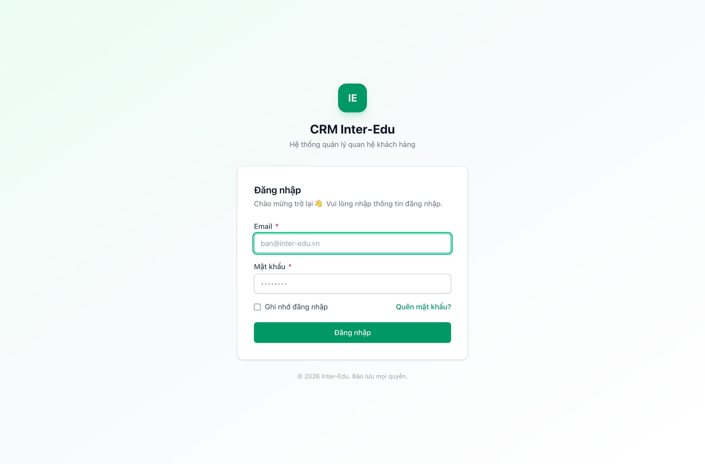{width=4.6in}

*Hình 1.1 — Màn hình đăng nhập*

> **Nếu đăng nhập không được:** Kiểm tra lại email/mật khẩu (chú ý chữ HOA–thường, dấu cách thừa). Nếu vẫn lỗi, dùng **Quên mật khẩu?** (mục 1.4) hoặc liên hệ quản trị viên.

Sau khi đăng nhập thành công, hệ thống đưa bạn vào màn hình **Dashboard** (Trang tổng quan).

## 1.2. Bố cục màn hình

Sau khi đăng nhập, mọi màn hình đều có chung bố cục gồm 3 phần:

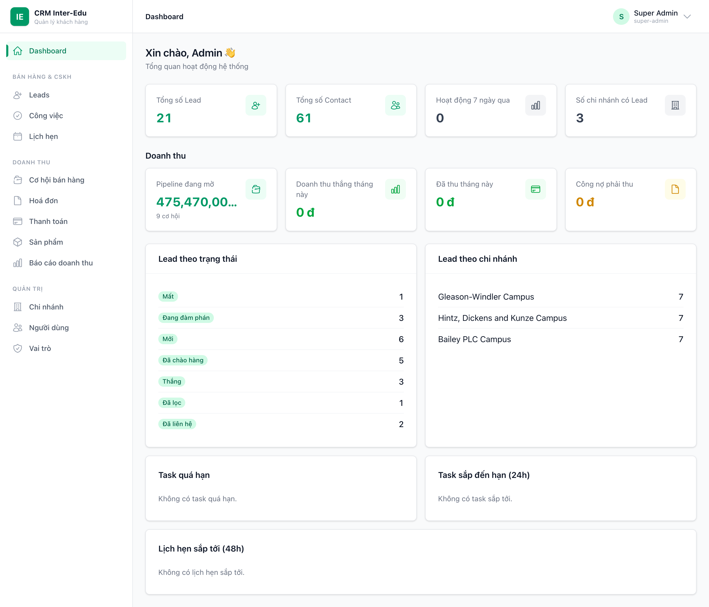{width=6.2in}

*Hình 1.2 — Bố cục chung của hệ thống (màn hình Dashboard)*

1. **Thanh menu bên trái (sidebar):** Danh sách tất cả các module, chia theo nhóm **BÁN HÀNG & CSKH**, **DOANH THU**, **QUẢN TRỊ**. Bấm vào tên module để mở module đó. Module đang mở được tô màu xanh nhạt.
2. **Thanh trên cùng (topbar):** Bên trái là **đường dẫn (breadcrumb)** cho biết bạn đang ở đâu (ví dụ *Dashboard › Leads*). Bên phải là **tên và vai trò** của bạn.
3. **Vùng nội dung (giữa):** Nơi hiển thị danh sách, biểu mẫu, chi tiết... của module đang chọn.

> **Mẹo:** Bấm vào breadcrumb (ví dụ chữ **Dashboard** hoặc **Leads** ở thanh trên) để quay nhanh về màn hình trước đó.

## 1.3. Đăng xuất

Bấm vào **tên của bạn** ở góc trên bên phải → chọn **Đăng xuất**. Luôn đăng xuất khi dùng máy tính chung.

## 1.4. Quên mật khẩu

1. Ở màn hình đăng nhập, bấm **Quên mật khẩu?**.
2. Nhập email của bạn và làm theo hướng dẫn gửi về hộp thư để đặt lại mật khẩu.

```{=openxml}
<w:p><w:r><w:br w:type="page"/></w:r></w:p>
```

# 2. Dashboard — Trang tổng quan

Đây là màn hình đầu tiên sau khi đăng nhập, cho bạn cái nhìn nhanh về tình hình kinh doanh. Để mở lại bất cứ lúc nào, bấm **Dashboard** trên menu trái.

{width=6.2in}

*Hình 2.1 — Màn hình Dashboard*

**Ý nghĩa các thẻ số liệu:**

- **Tổng số Lead:** Số trường học tiềm năng đang quản lý.
- **Tổng số Contact:** Số người liên hệ đã lưu.
- **Hoạt động 7 ngày qua:** Số lần trao đổi (gọi/email/họp/ghi chú) trong 7 ngày gần nhất.
- **Số chi nhánh có Lead:** (Super Admin) Số chi nhánh đang có khách tiềm năng.
- **Pipeline đang mở:** Tổng giá trị các cơ hội bán hàng **chưa chốt**.
- **Doanh thu thắng tháng này:** Giá trị các deal đã **Thắng** trong tháng.
- **Đã thu tháng này:** Số tiền thực nhận trong tháng.
- **Công nợ phải thu:** Số tiền khách còn nợ.

**Các bảng phía dưới:**

- **Lead theo trạng thái / Lead theo chi nhánh:** Phân bố khách tiềm năng.
- **Task quá hạn / Task sắp đến hạn (24h):** Nhắc việc cần xử lý gấp.
- **Lịch hẹn sắp tới (48h):** Các cuộc hẹn sắp diễn ra.

> **Mẹo:** Hãy xem Dashboard mỗi sáng để biết ngay việc quá hạn và lịch hẹn trong ngày.

```{=openxml}
<w:p><w:r><w:br w:type="page"/></w:r></w:p>
```

# 3. Module Leads — Khách hàng tiềm năng

**Lead** là một trường học/khách hàng tiềm năng. Đây là điểm bắt đầu của mọi quy trình bán hàng.

## 3.1. Xem danh sách Lead

Bấm **Leads** trên menu trái. Màn hình hiển thị danh sách tất cả Lead bạn được phép xem.

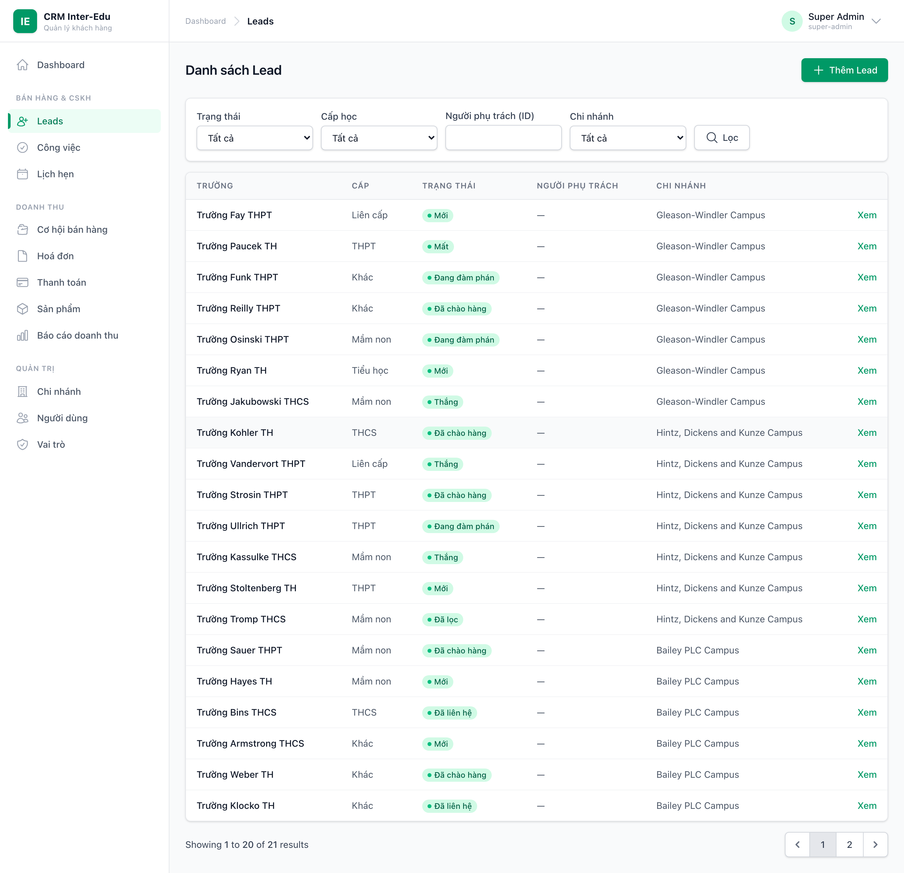{width=6.2in}

*Hình 3.1 — Danh sách Lead*

- **Bộ lọc (phần trên):** Lọc theo **Trạng thái**, **Cấp học**, **Người phụ trách (ID)**, **Chi nhánh**. Chọn điều kiện rồi bấm **Lọc**.
- **Bảng danh sách:** Mỗi dòng là một trường, gồm Tên trường, Cấp, Trạng thái, Người phụ trách, Chi nhánh.
- **Nút Xem:** Ở cuối mỗi dòng, bấm **Xem** để mở chi tiết Lead.
- **Phân trang:** Góc dưới phải, bấm số trang hoặc mũi tên để chuyển trang.

## 3.2. Thêm Lead mới

1. Ở màn hình **Danh sách Lead**, bấm nút xanh **+ Thêm Lead** (góc trên bên phải).
2. Một cửa sổ (popup) hiện ra. Điền thông tin:

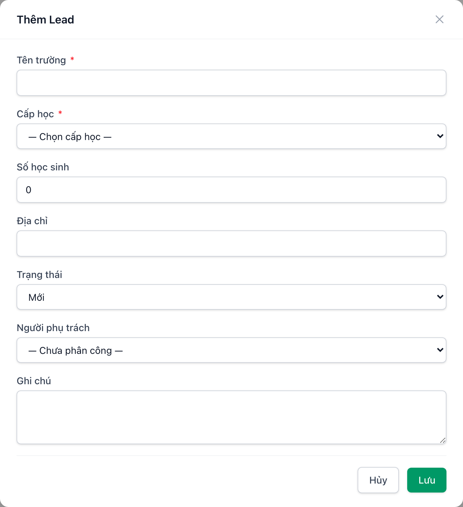{width=4.5in}

*Hình 3.2 — Cửa sổ thêm Lead*

| Trường | Bắt buộc | Giải thích |
|---|---|---|
| **Tên trường** | ✔ | Tên trường học/khách hàng |
| **Cấp học** | ✔ | Mầm non / Tiểu học / THCS / THPT / Liên cấp / Khác |
| **Số học sinh** | | Quy mô trường (số) |
| **Địa chỉ** | | Địa chỉ trường |
| **Trạng thái** | | Mặc định là *Mới* |
| **Người phụ trách** | | Nhân viên đảm nhận Lead này |
| **Ghi chú** | | Thông tin thêm |

3. Bấm **Lưu** để tạo. Bấm **Hủy** (hoặc dấu **✕**) để đóng mà không lưu.

> **Lưu ý:** Các ô có dấu **\*** màu đỏ là **bắt buộc**. Nếu bỏ trống, khi bấm Lưu hệ thống sẽ báo đỏ ngay dưới ô đó để bạn sửa.

## 3.3. Xem chi tiết một Lead

Từ danh sách, bấm **Xem** ở dòng tương ứng. Trang chi tiết là "trung tâm điều khiển" của Lead — gần như mọi việc liên quan đến trường này đều làm tại đây.

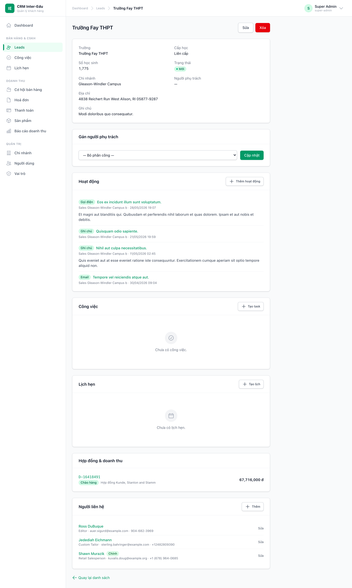{width=5.0in}

*Hình 3.3 — Trang chi tiết Lead*

Trang gồm các khu vực (từ trên xuống):

1. **Thông tin trường:** Các thông tin đã nhập. Góc trên phải có nút **Sửa** và **Xóa**.
2. **Gán người phụ trách:** Chọn nhân viên từ danh sách rồi bấm **Cập nhật** để giao Lead (xem mục 3.5).
3. **Hoạt động:** Lịch sử trao đổi. Bấm **+ Thêm hoạt động** để ghi nhận (xem Module 5).
4. **Công việc:** Việc cần làm gắn với Lead. Bấm **+ Tạo task** (xem Module 6).
5. **Lịch hẹn:** Cuộc hẹn gắn với Lead. Bấm **+ Tạo lịch** (xem Module 7).
6. **Hợp đồng & doanh thu:** Cơ hội bán hàng (deal) của Lead (xem Module 9).
7. **Người liên hệ:** Danh sách người liên hệ. Bấm **+ Thêm** (xem Module 4).

> **Mẹo:** Cuối trang luôn có liên kết **← Quay lại danh sách**.

## 3.4. Sửa / Xóa Lead

- **Sửa:** Ở trang chi tiết, bấm **Sửa** (góc trên phải). Cửa sổ chỉnh sửa hiện ra **giống hệt** cửa sổ Thêm nhưng đã điền sẵn dữ liệu. Sửa xong bấm **Lưu**.
- **Xóa:** Bấm **Xóa** (nút đỏ). Hệ thống sẽ hỏi xác nhận. **Hành động xóa không khôi phục được** — hãy cân nhắc kỹ.

## 3.5. Phân công người phụ trách

Để giao một Lead cho nhân viên:

1. Mở chi tiết Lead.
2. Ở khu vực **Gán người phụ trách**, mở danh sách thả xuống và chọn tên nhân viên (chọn *— Bỏ phân công —* để gỡ).
3. Bấm **Cập nhật**.

```{=openxml}
<w:p><w:r><w:br w:type="page"/></w:r></w:p>
```

# 4. Module Liên hệ (Contacts)

**Liên hệ** là những người cụ thể tại trường (hiệu trưởng, phụ huynh, người phụ trách...). Liên hệ luôn gắn với một Lead.

## 4.1. Thêm người liên hệ

1. Mở **chi tiết Lead** (Module 3.3).
2. Kéo xuống khu vực **Người liên hệ**, bấm **+ Thêm**.
3. Điền thông tin trong cửa sổ:

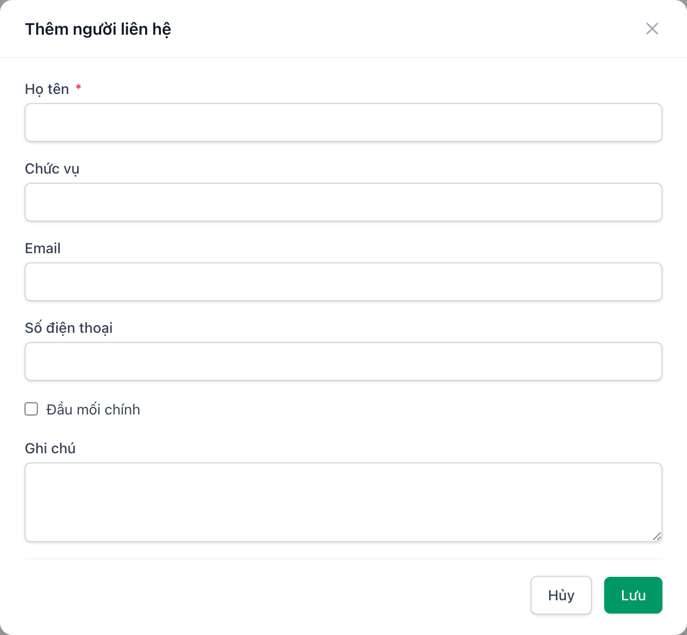{width=4.5in}

*Hình 4.1 — Cửa sổ thêm người liên hệ*

| Trường | Bắt buộc | Giải thích |
|---|---|---|
| **Họ tên** | ✔ | Tên người liên hệ |
| **Chức vụ** | | Ví dụ: Hiệu trưởng, Phụ huynh |
| **Email** | | Email liên hệ |
| **Số điện thoại** | | Số điện thoại |
| **Ghi chú** | | Thông tin thêm |

4. Bấm **Lưu**.

## 4.2. Sửa người liên hệ & đặt liên hệ chính

- Trong khu vực **Người liên hệ** của trang chi tiết Lead, mỗi người có nút **Sửa**. Bấm để mở cửa sổ chỉnh sửa.
- Trong cửa sổ có tuỳ chọn đánh dấu **liên hệ chính** — người này sẽ được gắn nhãn **Chính** để dễ nhận biết người quan trọng nhất của trường.

```{=openxml}
<w:p><w:r><w:br w:type="page"/></w:r></w:p>
```

# 5. Module Hoạt động (Activities)

**Hoạt động** là lịch sử trao đổi với khách: mỗi lần gọi điện, gửi email, họp hay ghi chú đều nên được ghi lại để cả nhóm cùng nắm.

## 5.1. Ghi nhận một hoạt động

1. Mở **chi tiết Lead** (Module 3.3).
2. Ở khu vực **Hoạt động**, bấm **+ Thêm hoạt động**.
3. Điền thông tin:

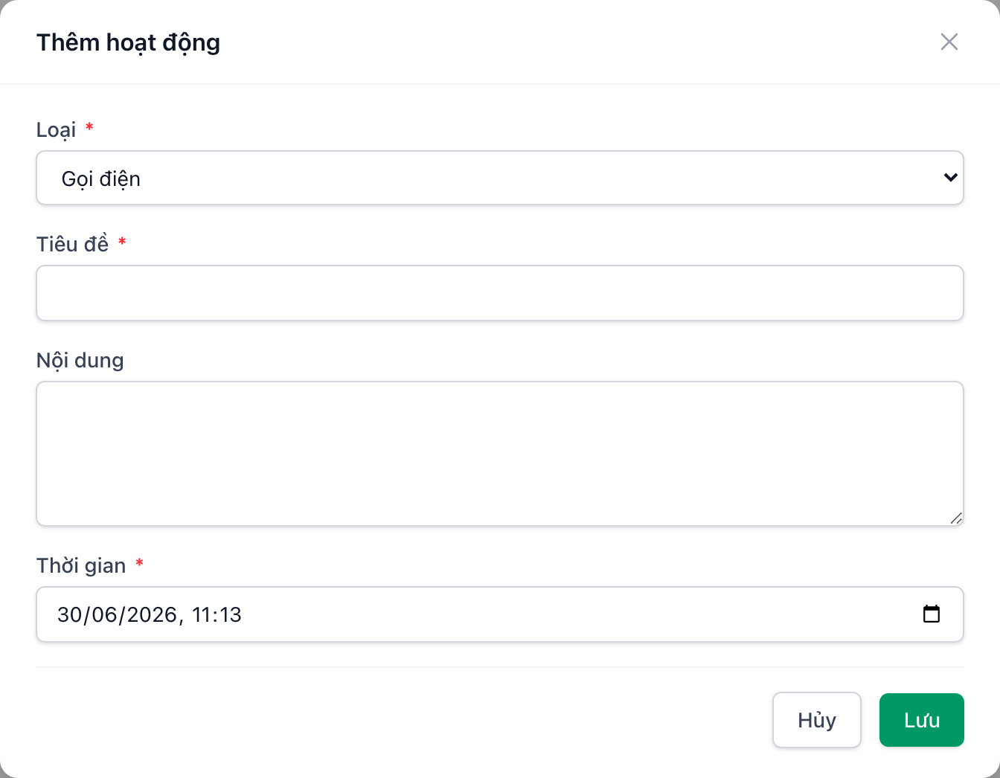{width=4.5in}

*Hình 5.1 — Cửa sổ ghi nhận hoạt động*

| Trường | Bắt buộc | Giải thích |
|---|---|---|
| **Loại** | ✔ | Gọi điện / Email / Họp / Ghi chú |
| **Tiêu đề** | ✔ | Tóm tắt ngắn nội dung |
| **Nội dung** | | Mô tả chi tiết buổi trao đổi |
| **Thời gian** | | Thời điểm diễn ra |

4. Bấm **Lưu**. Hoạt động mới sẽ xuất hiện ở đầu danh sách hoạt động của Lead.

> **Mẹo:** Ghi hoạt động ngay sau mỗi cuộc gọi/họp để không quên. Lịch sử đầy đủ giúp người khác tiếp nhận Lead dễ dàng khi bạn vắng mặt.

```{=openxml}
<w:p><w:r><w:br w:type="page"/></w:r></w:p>
```

# 6. Module Công việc (Tasks)

**Công việc (Task)** là những việc cần làm, ví dụ "Gọi lại trường A", "Gửi báo giá". Có thể gắn công việc với một Lead.

## 6.1. Bảng Kanban (kéo–thả)

Bấm **Công việc** trên menu trái. Mặc định hiển thị dạng **Kanban** — các thẻ việc được chia thành 4 cột theo trạng thái.

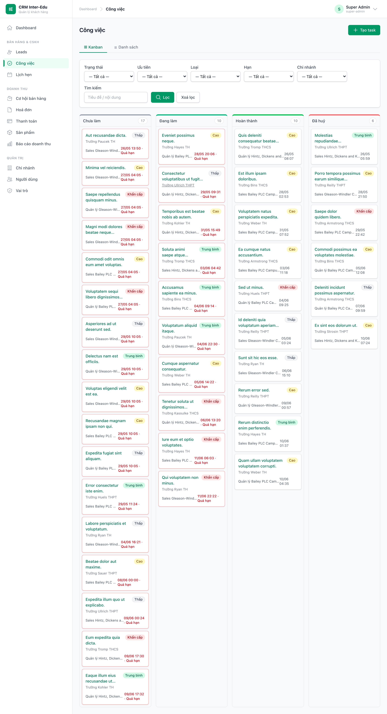{width=5.0in}

*Hình 6.1 — Bảng Kanban công việc*

- 4 cột: **Chưa làm** → **Đang làm** → **Hoàn thành** → **Đã huỷ**. Con số ở đầu cột là số việc trong cột đó.
- Mỗi thẻ hiển thị tiêu đề, mức **Ưu tiên** (Thấp/Trung bình/Cao/Khẩn cấp), trường liên quan, người phụ trách và **hạn chót** (đỏ kèm chữ *Quá hạn* nếu trễ).
- **Đổi trạng thái:** Dùng chuột **kéo một thẻ** từ cột này **thả** sang cột khác. Hệ thống tự lưu.
- **Bộ lọc** phía trên: lọc theo Trạng thái, Ưu tiên, Loại, Hạn, Chi nhánh, hoặc gõ từ khoá vào ô **Tìm kiếm** rồi bấm **Lọc**.

> **Lưu ý:** Nếu kéo–thả mà hệ thống báo không cập nhật được, có thể bạn không có quyền sửa công việc đó; thẻ sẽ tự quay về cột cũ.

## 6.2. Xem dạng Danh sách

Bấm tab **☰ Danh sách** (cạnh tab Kanban, phía trên) để xem công việc dưới dạng bảng — tiện khi cần sắp xếp/duyệt nhiều việc.

## 6.3. Tạo công việc mới

1. Bấm nút **+ Tạo task** (góc trên phải màn hình Công việc), hoặc bấm **+ Tạo task** trong chi tiết một Lead để gắn sẵn việc vào Lead đó.
2. Điền thông tin:

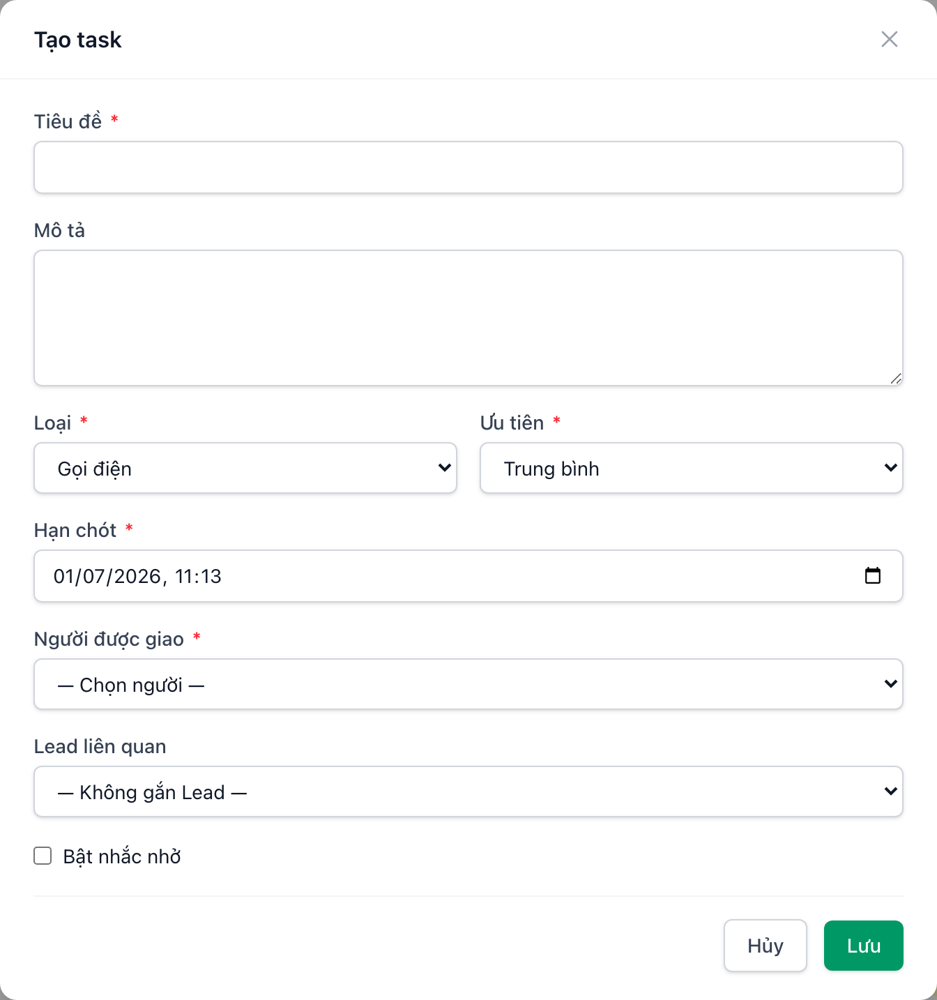{width=4.5in}

*Hình 6.2 — Cửa sổ tạo công việc*

| Trường | Bắt buộc | Giải thích |
|---|---|---|
| **Tiêu đề** | ✔ | Tên công việc |
| **Mô tả** | | Chi tiết việc cần làm |
| **Loại** | | Gọi điện / Email / Họp / Theo dõi / Khác |
| **Ưu tiên** | | Thấp / Trung bình / Cao / Khẩn cấp |
| **Hạn chót** | | Thời hạn hoàn thành |
| **Người được giao** | | Nhân viên phụ trách việc |
| **Lead liên quan** | | Gắn việc với một trường |
| **Thời điểm nhắc** | | Bật nhắc nhở và chọn thời điểm |

3. Bấm **Lưu**.

## 6.4. Cập nhật tiến độ công việc

Mở chi tiết một công việc (bấm vào tiêu đề thẻ).

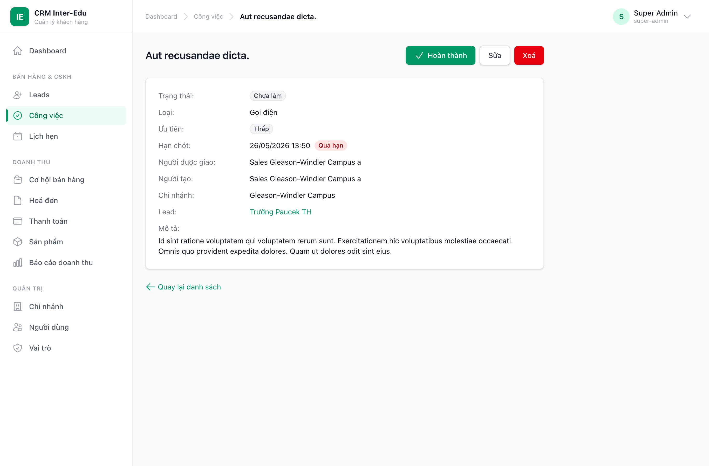{width=6.2in}

*Hình 6.3 — Chi tiết công việc*

Tại đây, ngoài kéo–thả trên Kanban, bạn có thể đổi trạng thái bằng nút:

- **Bắt đầu:** chuyển sang *Đang làm*.
- **Hoàn thành:** chuyển sang *Hoàn thành*.
- **Mở lại:** đưa việc đã xong/đã huỷ trở lại *Chưa làm*.

```{=openxml}
<w:p><w:r><w:br w:type="page"/></w:r></w:p>
```

# 7. Module Lịch hẹn (Events)

**Lịch hẹn** dùng để lên lịch các cuộc họp, cuộc gọi, buổi gặp tại trường hoặc trực tuyến.

## 7.1. Xem theo Lịch tháng

Bấm **Lịch hẹn** trên menu trái rồi mở dạng **Lịch**.

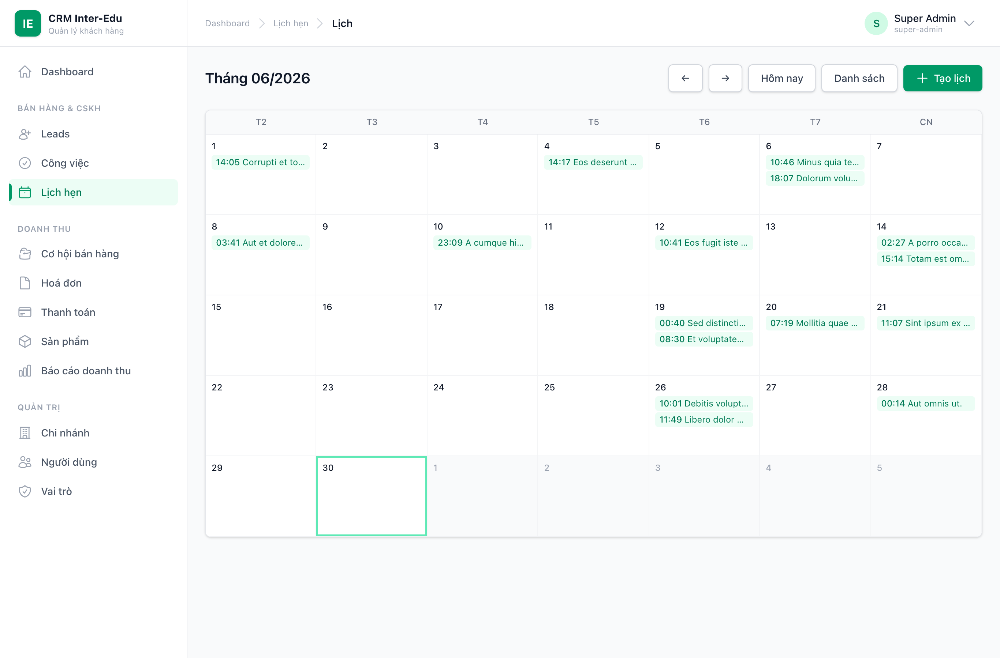{width=6.2in}

*Hình 7.1 — Lịch tháng*

- Tiêu đề cho biết tháng đang xem (ví dụ *Tháng 06/2026*).
- Nút **←** / **→** chuyển tháng trước/sau; nút **Hôm nay** quay về tháng hiện tại (ô ngày hôm nay được viền xanh).
- Mỗi cuộc hẹn hiển thị dưới dạng nhãn xanh kèm giờ. Bấm vào nhãn để mở chi tiết.
- Nút **Danh sách** chuyển sang xem dạng bảng; nút **+ Tạo lịch** để tạo mới.

## 7.2. Xem theo Danh sách

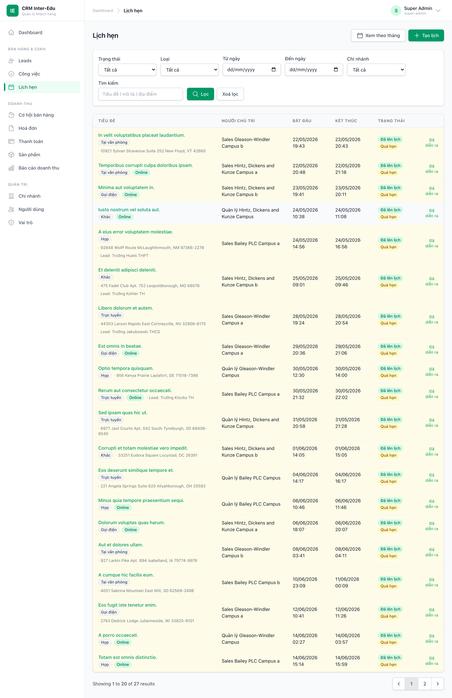{width=6.2in}

*Hình 7.2 — Danh sách lịch hẹn*

Dạng danh sách liệt kê các cuộc hẹn kèm trạng thái (**Đã lên lịch** / **Đã diễn ra** / **Đã huỷ**), thuận tiện khi cần lọc và rà soát.

## 7.3. Tạo lịch hẹn

1. Bấm **+ Tạo lịch** (trên lịch hoặc danh sách), hoặc **+ Tạo lịch** trong chi tiết Lead.
2. Điền thông tin:

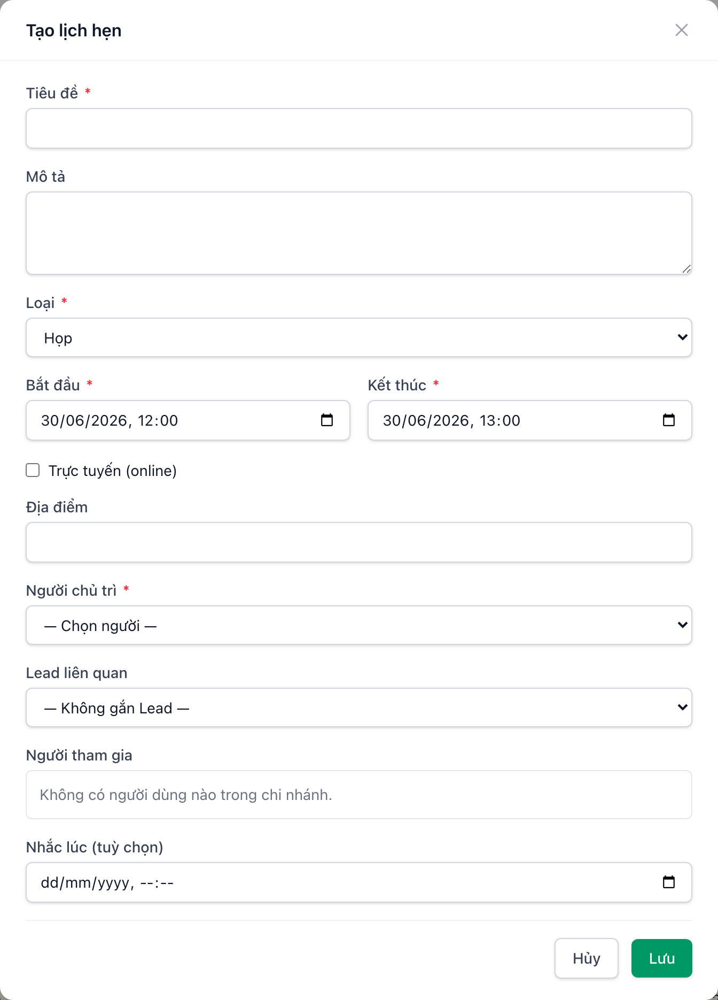{width=4.5in}

*Hình 7.3 — Cửa sổ tạo lịch hẹn*

| Trường | Bắt buộc | Giải thích |
|---|---|---|
| **Tiêu đề** | ✔ | Tên cuộc hẹn |
| **Mô tả** | | Nội dung/chương trình |
| **Loại** | | Họp / Gọi điện / Tại văn phòng / Trực tuyến / Khác |
| **Bắt đầu**, **Kết thúc** | ✔ | Thời gian diễn ra |
| **URL phòng họp** | | Link họp online (nếu trực tuyến) |
| **Địa điểm** | | Nơi gặp (nếu offline) |
| **Người chủ trì** | | Người phụ trách cuộc hẹn |
| **Lead liên quan** | | Gắn với một trường |
| **Nhắc lúc** | | Thời điểm nhắc trước cuộc hẹn |

3. Bấm **Lưu**.

## 7.4. Cập nhật một cuộc hẹn

Mở chi tiết một cuộc hẹn:

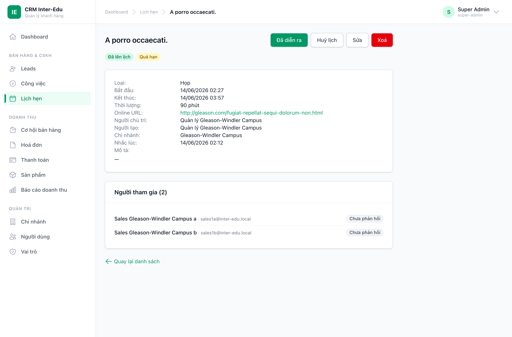{width=6.2in}

*Hình 7.4 — Chi tiết lịch hẹn*

Các thao tác có thể có:

- **Đánh dấu đã diễn ra:** chuyển trạng thái sang *Đã diễn ra* sau khi gặp xong.
- **Hủy:** huỷ cuộc hẹn.
- **Phản hồi (tham gia/không):** xác nhận tham dự nếu bạn là người được mời.

```{=openxml}
<w:p><w:r><w:br w:type="page"/></w:r></w:p>
```

# 8. Module Sản phẩm (Products)

**Sản phẩm** là danh mục các khoá học/gói dịch vụ. Khi lập hợp đồng (deal), bạn sẽ chọn sản phẩm từ danh mục này.

## 8.1. Danh sách sản phẩm

Bấm **Sản phẩm** trên menu trái.

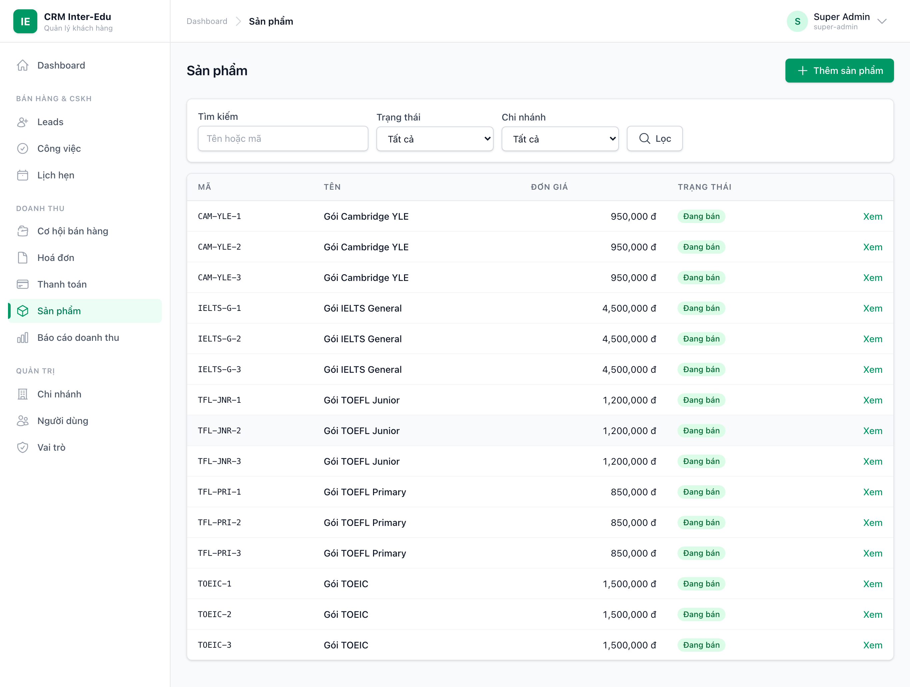{width=6.2in}

*Hình 8.1 — Danh sách sản phẩm*

Danh sách gồm mã, tên, đơn giá và trạng thái bật/tắt của từng sản phẩm.

## 8.2. Thêm sản phẩm

1. Bấm **+ Thêm sản phẩm**.
2. Điền thông tin:

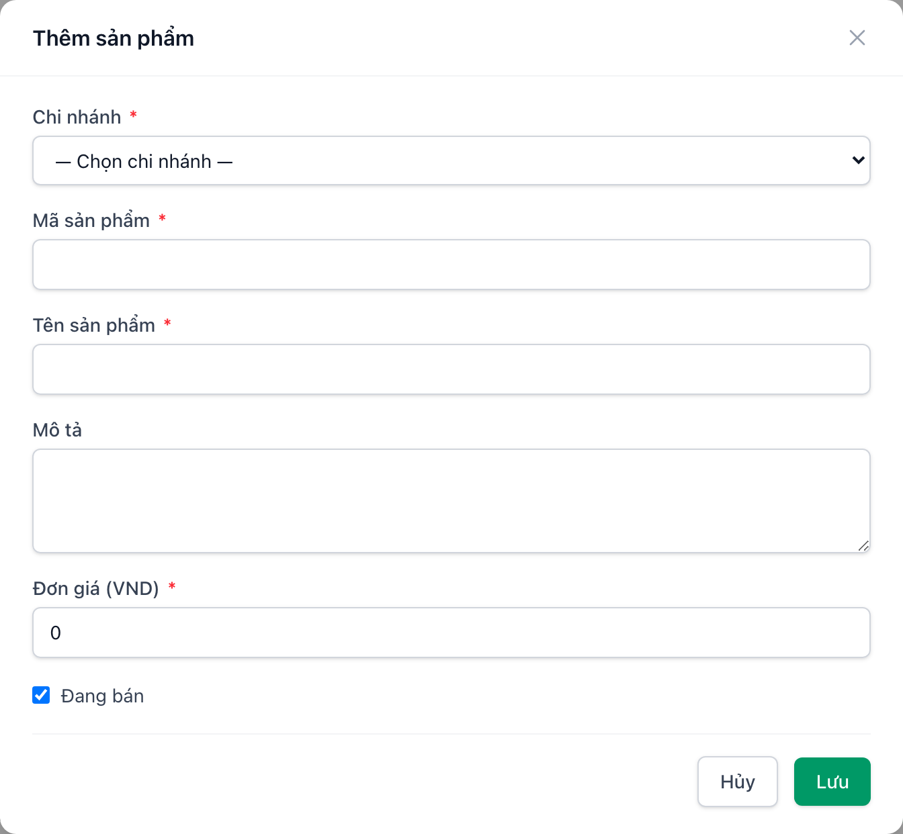{width=4.5in}

*Hình 8.2 — Cửa sổ thêm sản phẩm*

| Trường | Bắt buộc | Giải thích |
|---|---|---|
| **Chi nhánh** | | Chi nhánh áp dụng |
| **Mã sản phẩm** | | Mã ngắn để tra cứu |
| **Tên sản phẩm** | ✔ | Tên gói/khoá học |
| **Mô tả** | | Mô tả chi tiết |
| **Đơn giá (VND)** | ✔ | Giá mặc định |

3. Bấm **Lưu**. Có thể bật/tắt **đang hoạt động** để ẩn sản phẩm ngừng bán.

> **Phân quyền:** Nhân viên Sales thường chỉ **xem** được sản phẩm; việc thêm/sửa/xoá do Quản lý hoặc Super Admin thực hiện.

```{=openxml}
<w:p><w:r><w:br w:type="page"/></w:r></w:p>
```

# 9. Module Cơ hội bán hàng (Deals)

**Deal (Cơ hội bán hàng)** đại diện cho một thương vụ với một trường. **Mỗi Lead chỉ có một Deal** (1 Lead = 1 Deal). Đây là nơi quản lý sản phẩm bán, giá trị hợp đồng và trạng thái thắng/thua.

## 9.1. Danh sách Deal

Bấm **Cơ hội bán hàng** trên menu trái.

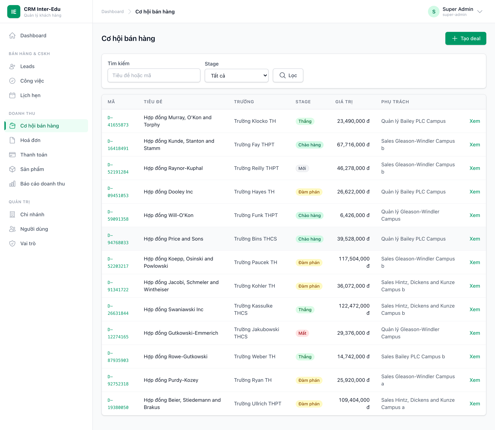{width=6.2in}

*Hình 9.1 — Danh sách cơ hội bán hàng*

Mỗi dòng hiển thị mã deal, trường, giai đoạn (**Mới → Chào hàng → Đàm phán → Thắng/Mất**), giá trị và người phụ trách.

## 9.2. Tạo Deal mới

1. Bấm **+ Tạo deal** (hoặc tạo từ chi tiết Lead).
2. Điền thông tin:

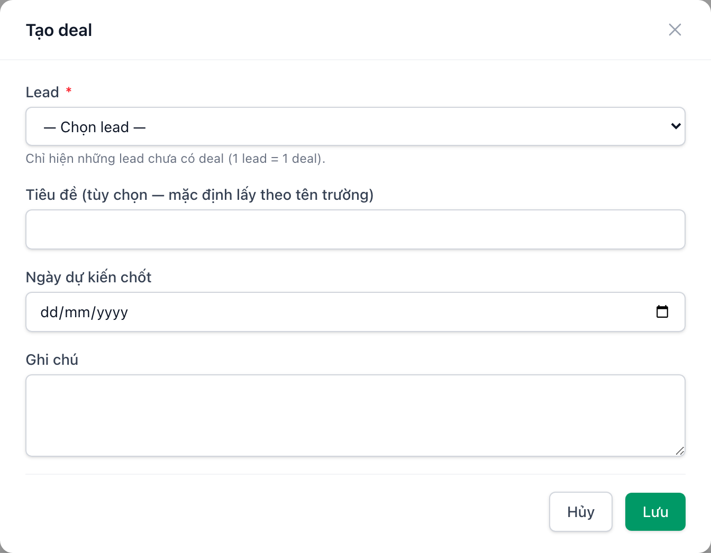{width=4.5in}

*Hình 9.2 — Cửa sổ tạo deal*

| Trường | Bắt buộc | Giải thích |
|---|---|---|
| **Lead** | ✔ | Chọn trường. *Chỉ hiện những Lead chưa có deal.* |
| **Tiêu đề** | | Bỏ trống sẽ tự lấy theo tên trường |
| **Người phụ trách** | | Nhân viên phụ trách deal |
| **Ngày dự kiến chốt** | | Ngày dự kiến ký hợp đồng |
| **Ghi chú** | | Thông tin thêm |

3. Bấm **Lưu**.

## 9.3. Chi tiết Deal & thêm sản phẩm

Mở chi tiết một deal (bấm mã deal hoặc **Xem**).

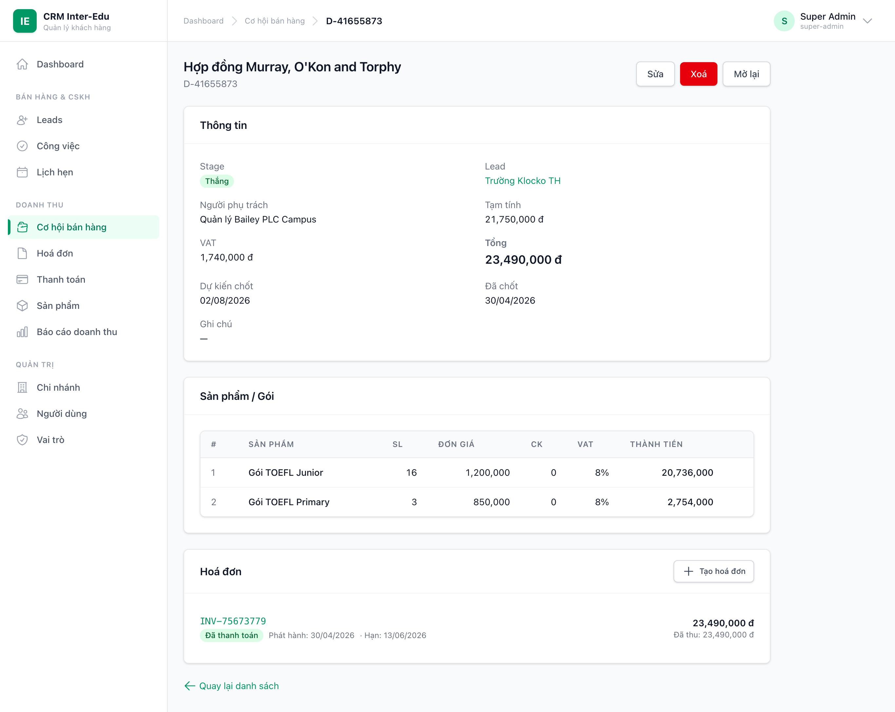{width=6.2in}

*Hình 9.3 — Chi tiết deal*

Trang gồm:

1. **Thông tin:** Giai đoạn, Lead, người phụ trách, **Tạm tính / VAT / Tổng**, ngày dự kiến và ngày chốt. Góc trên phải có **Sửa**, **Xóa**, và nút **Thắng / Mất / Mở lại** (tuỳ giai đoạn).
2. **Sản phẩm / Gói:** Bảng các dòng sản phẩm trong hợp đồng. Khi deal **còn mở**, có nút **+ Thêm dòng**; mỗi dòng có nút sửa/xoá.
3. **Hoá đơn:** Danh sách hoá đơn của deal và nút **+ Tạo hoá đơn** (xem Module 10).

### Thêm dòng sản phẩm vào Deal

1. Trong khu vực **Sản phẩm / Gói**, bấm **+ Thêm dòng** (chỉ hiện khi deal đang mở).
2. Điền thông tin:

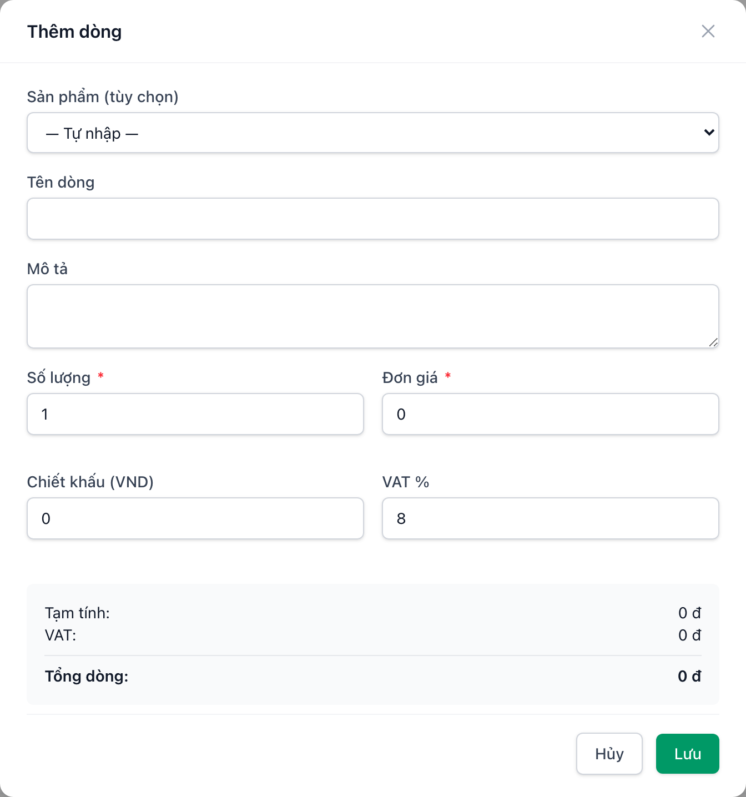{width=4.5in}

*Hình 9.4 — Cửa sổ thêm dòng sản phẩm*

| Trường | Bắt buộc | Giải thích |
|---|---|---|
| **Sản phẩm** | | Chọn từ danh mục (tự điền tên & giá) |
| **Tên dòng** | ✔ | Tên hiển thị trên hợp đồng |
| **Mô tả** | | Ghi chú dòng |
| **Số lượng** | ✔ | Số lượng |
| **Đơn giá** | ✔ | Giá một đơn vị |
| **Chiết khấu (VND)** | | Số tiền giảm |
| **VAT %** | | Thuế suất (ví dụ 8) |

3. Bấm **Lưu**. Hệ thống tự tính lại **Tạm tính/VAT/Tổng** của deal.

### Chốt Deal: Thắng / Mất / Mở lại

- **Thắng:** Bấm khi khách đồng ý ký. Deal chuyển sang *Thắng* — lúc này mới nên lập hoá đơn.
- **Mất:** Bấm khi khách từ chối.
- **Mở lại:** Đưa deal đã đóng quay lại trạng thái đang mở để tiếp tục đàm phán.

```{=openxml}
<w:p><w:r><w:br w:type="page"/></w:r></w:p>
```

# 10. Module Hoá đơn (Invoices)

**Hoá đơn** được lập cho một Deal để yêu cầu khách thanh toán.

## 10.1. Danh sách hoá đơn

Bấm **Hoá đơn** trên menu trái.

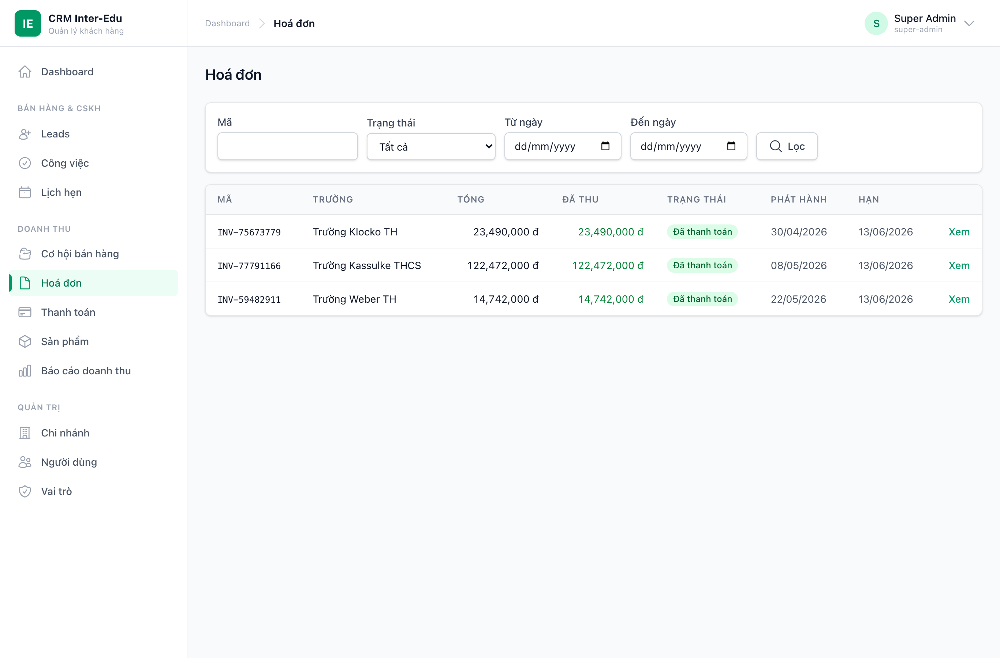{width=6.2in}

*Hình 10.1 — Danh sách hoá đơn*

Mỗi dòng gồm mã hoá đơn, trường/deal, tổng tiền, đã thu và **trạng thái**.

## 10.2. Tạo hoá đơn từ Deal

1. Mở **chi tiết Deal** (Module 9.3). Ở khu vực **Hoá đơn**, bấm **+ Tạo hoá đơn**.
2. Điền thông tin:

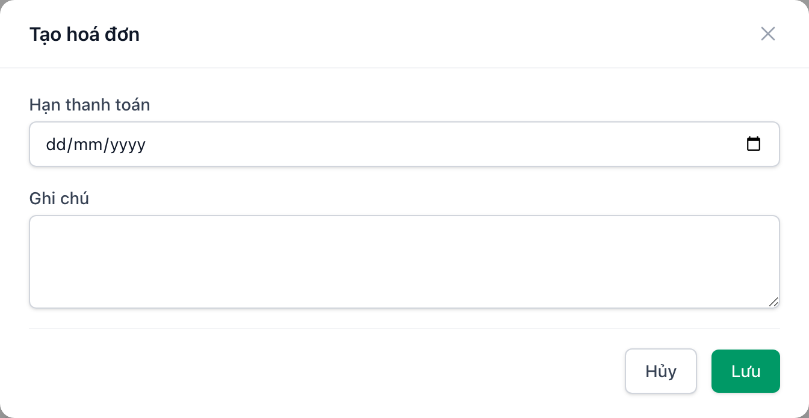{width=4.5in}

*Hình 10.2 — Cửa sổ tạo hoá đơn*

| Trường | Bắt buộc | Giải thích |
|---|---|---|
| **Hạn thanh toán** | | Ngày khách phải trả |
| **Ghi chú** | | Thông tin thêm |

Hoá đơn tự lấy danh sách sản phẩm và số tiền từ Deal, nên bạn không cần nhập lại.

3. Bấm **Lưu**. Hoá đơn được tạo ở trạng thái **Nháp**.

## 10.3. Chi tiết hoá đơn: Phát hành & Huỷ

Mở chi tiết một hoá đơn.

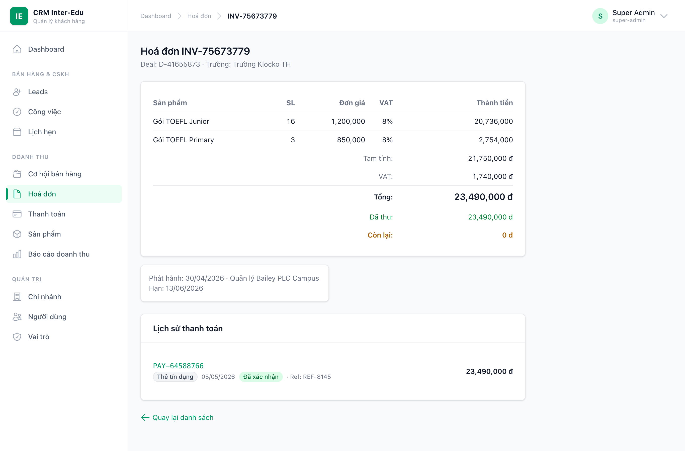{width=6.2in}

*Hình 10.3 — Chi tiết hoá đơn*

Trang hiển thị bảng sản phẩm, **Tạm tính / VAT / Tổng / Đã thu / Còn lại**, thông tin phát hành và **Lịch sử thanh toán**. Tuỳ trạng thái sẽ có các nút:

- **Phát hành:** Có ở hoá đơn *Nháp*. Bấm để chính thức phát hành — sau đó mới ghi nhận được thanh toán.
- **Sửa:** Chỉ sửa được khi còn *Nháp*.
- **Huỷ:** Có khi hoá đơn đã phát hành/đang thu dở/quá hạn — dùng khi cần huỷ bỏ hoá đơn.

## 10.4. Vòng đời trạng thái hoá đơn

| Trạng thái | Ý nghĩa |
|---|---|
| **Nháp** | Mới tạo, chưa phát hành (còn sửa được) |
| **Đã phát hành** | Đã gửi khách, chờ thanh toán |
| **Thanh toán một phần** | Khách đã trả một phần |
| **Đã thanh toán** | Đã thu đủ |
| **Quá hạn** | Quá hạn thanh toán mà chưa đủ |
| **Đã huỷ** | Đã huỷ bỏ |

```{=openxml}
<w:p><w:r><w:br w:type="page"/></w:r></w:p>
```

# 11. Module Thanh toán (Payments)

**Thanh toán** dùng để ghi nhận mỗi lần khách trả tiền cho một hoá đơn.

## 11.1. Ghi nhận thanh toán

1. Mở **chi tiết hoá đơn** đã **phát hành** (Module 10.3). Bấm **+ Ghi nhận thanh toán**.
2. Điền thông tin:

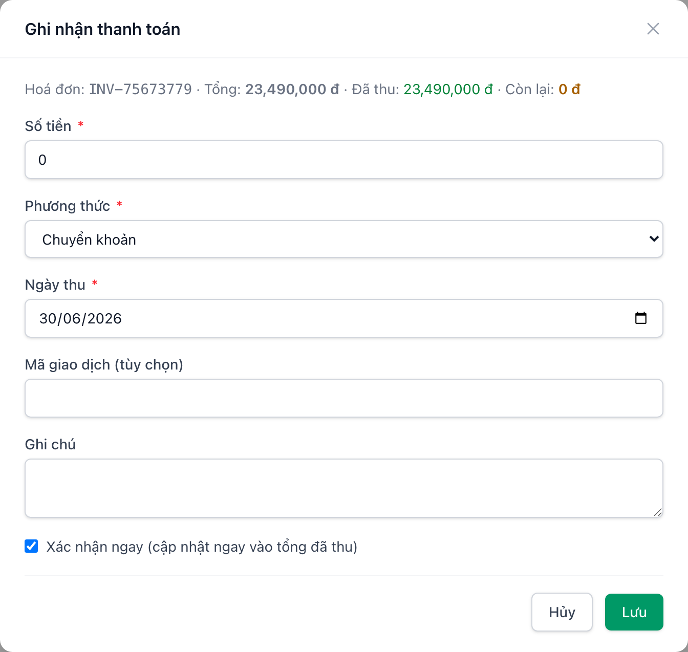{width=4.5in}

*Hình 11.1 — Cửa sổ ghi nhận thanh toán*

| Trường | Bắt buộc | Giải thích |
|---|---|---|
| **Số tiền** | ✔ | Số tiền khách trả lần này |
| **Phương thức** | ✔ | Chuyển khoản / Tiền mặt / Thẻ tín dụng / Ví điện tử / Khác |
| **Ngày thu** | ✔ | Ngày nhận tiền |
| **Mã giao dịch** | | Mã tham chiếu (số UNC, mã thẻ...) |
| **Ghi chú** | | Thông tin thêm |
| **Xác nhận ngay** | | Tích để cộng ngay vào *Đã thu* của hoá đơn |

3. Bấm **Lưu**. Phần **Đã thu / Còn lại** của hoá đơn được cập nhật.

> **Mẹo:** Phần đầu cửa sổ luôn nhắc *Tổng / Đã thu / Còn lại* của hoá đơn để bạn nhập đúng số tiền.

## 11.2. Chi tiết & xác nhận thanh toán

Mở chi tiết một khoản thanh toán (từ lịch sử thanh toán của hoá đơn, hoặc menu **Thanh toán**).

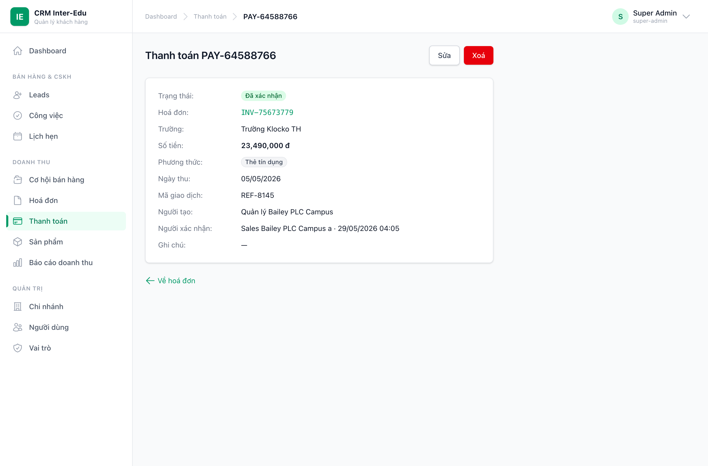{width=6.2in}

*Hình 11.2 — Chi tiết thanh toán*

- Nếu thanh toán **chưa xác nhận**, sẽ có nút **Xác nhận** — bấm để chính thức ghi nhận khoản tiền vào doanh thu đã thu.

```{=openxml}
<w:p><w:r><w:br w:type="page"/></w:r></w:p>
```

# 12. Báo cáo doanh thu

Bấm **Báo cáo doanh thu** trên menu trái để xem bức tranh tài chính tổng thể.

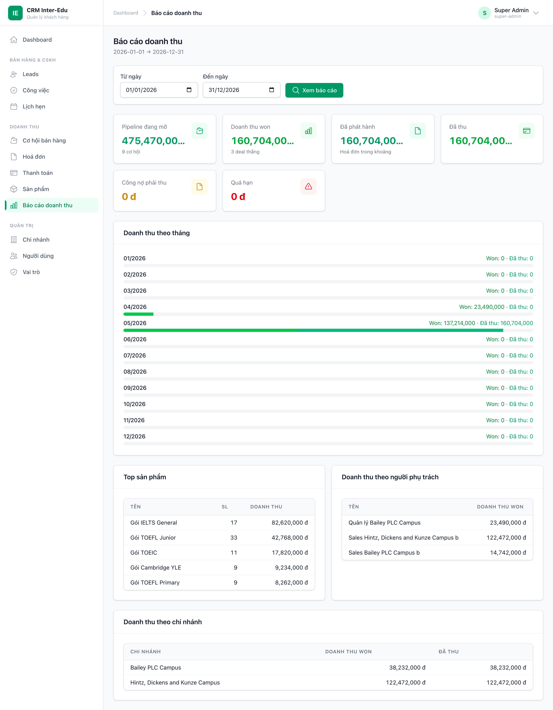{width=6.0in}

*Hình 12.1 — Báo cáo doanh thu*

**Cách dùng:**

1. Chọn **Từ ngày** và **Đến ngày**.
2. Bấm **Xem báo cáo**. Toàn bộ số liệu bên dưới cập nhật theo khoảng thời gian đã chọn.

**Nội dung báo cáo:**

- **Thẻ tổng quan:** Pipeline đang mở, Doanh thu won, Đã phát hành, Đã thu, Công nợ phải thu, Quá hạn.
- **Doanh thu theo tháng:** Biểu đồ cột so sánh từng tháng (Won và Đã thu).
- **Top sản phẩm:** Sản phẩm bán chạy theo số lượng và doanh thu.
- **Doanh thu theo người phụ trách:** Thành tích từng nhân viên.
- **Doanh thu theo chi nhánh:** So sánh giữa các chi nhánh (với Super Admin).

```{=openxml}
<w:p><w:r><w:br w:type="page"/></w:r></w:p>
```

# 13. Quản trị hệ thống

Nhóm **QUẢN TRỊ** dành cho Super Admin và Quản lý chi nhánh. Nhân viên Sales thường không thấy nhóm này.

## 13.1. Chi nhánh (chỉ Super Admin)

Bấm **Chi nhánh** trên menu trái.

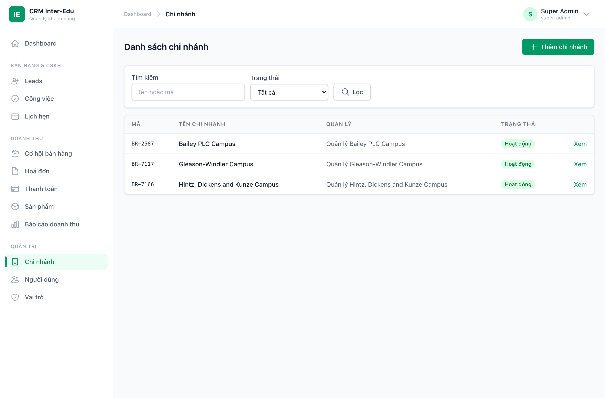{width=6.2in}

*Hình 13.1 — Danh sách chi nhánh*

**Thêm chi nhánh:** Bấm **+ Thêm chi nhánh** rồi điền:

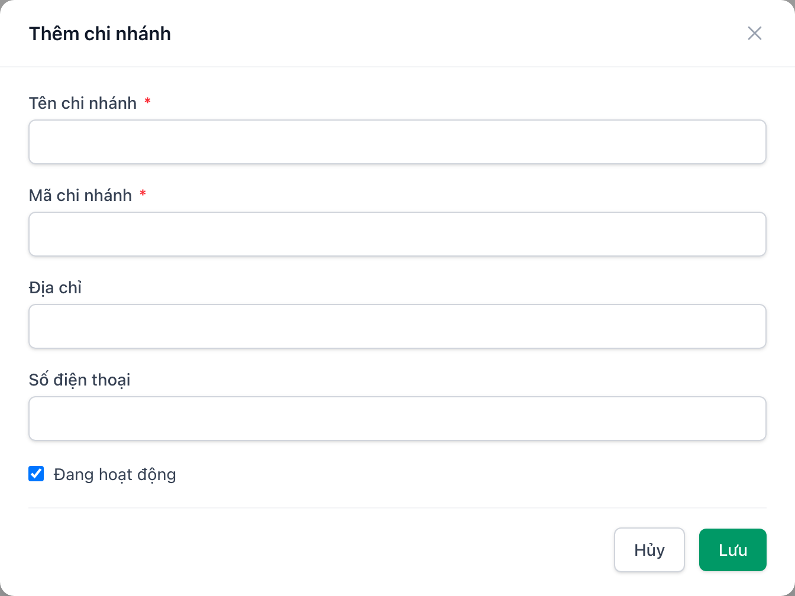{width=4.5in}

*Hình 13.2 — Cửa sổ thêm chi nhánh*

| Trường | Bắt buộc | Giải thích |
|---|---|---|
| **Tên chi nhánh** | ✔ | Tên cơ sở/chi nhánh |
| **Mã chi nhánh** | | Mã ngắn |
| **Địa chỉ** | | Địa chỉ |
| **Số điện thoại** | | Số điện thoại |

> **Quan trọng:** Mỗi nhân viên thuộc về một chi nhánh và **chỉ thấy dữ liệu của chi nhánh mình**. Đây là cơ chế cách ly dữ liệu giữa các cơ sở.

## 13.2. Người dùng

Bấm **Người dùng** trên menu trái để quản lý tài khoản nhân viên.

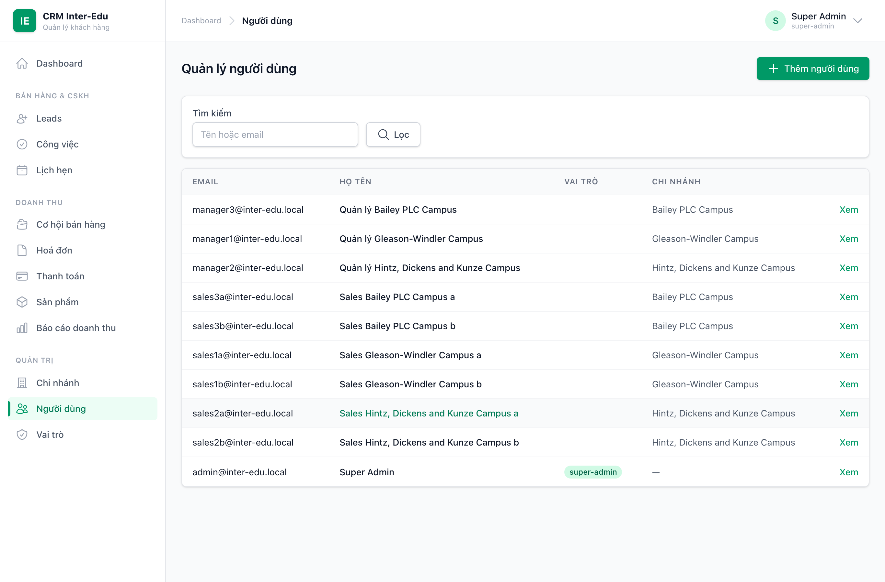{width=6.2in}

*Hình 13.3 — Danh sách người dùng*

**Thêm người dùng:** Bấm **+ Thêm người dùng** rồi điền:

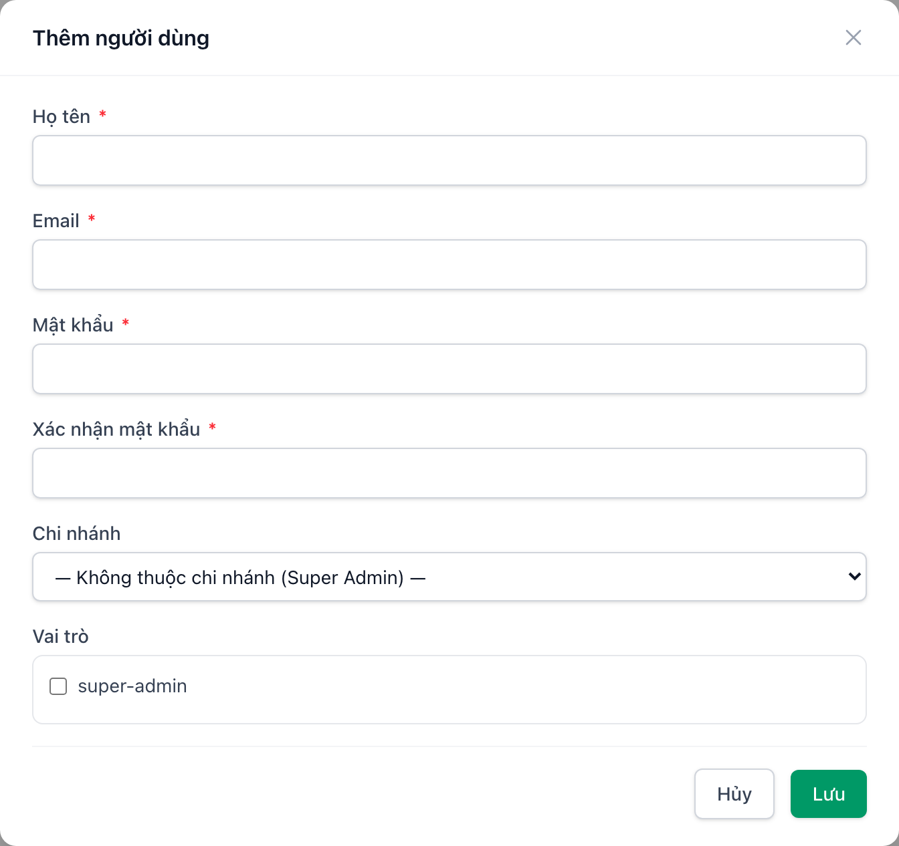{width=4.5in}

*Hình 13.4 — Cửa sổ thêm người dùng*

| Trường | Bắt buộc | Giải thích |
|---|---|---|
| **Họ tên** | ✔ | Tên nhân viên |
| **Email** | ✔ | Dùng để đăng nhập |
| **Mật khẩu** | ✔ | Mật khẩu ban đầu |
| **Xác nhận mật khẩu** | ✔ | Nhập lại mật khẩu |
| **Chi nhánh** | | Chi nhánh nhân viên thuộc về |

Sau khi tạo, mở **chi tiết người dùng** để gán **vai trò** cho họ:

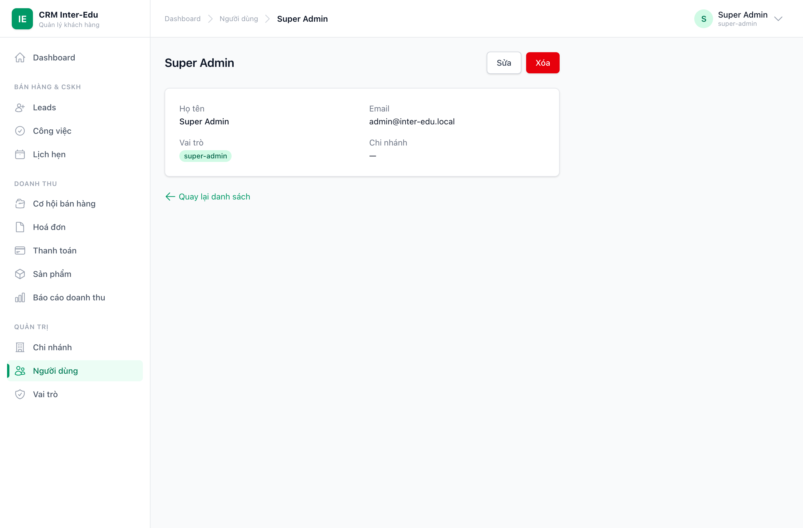{width=6.2in}

*Hình 13.5 — Chi tiết người dùng*

## 13.3. Vai trò & phân quyền

Bấm **Vai trò** trên menu trái.

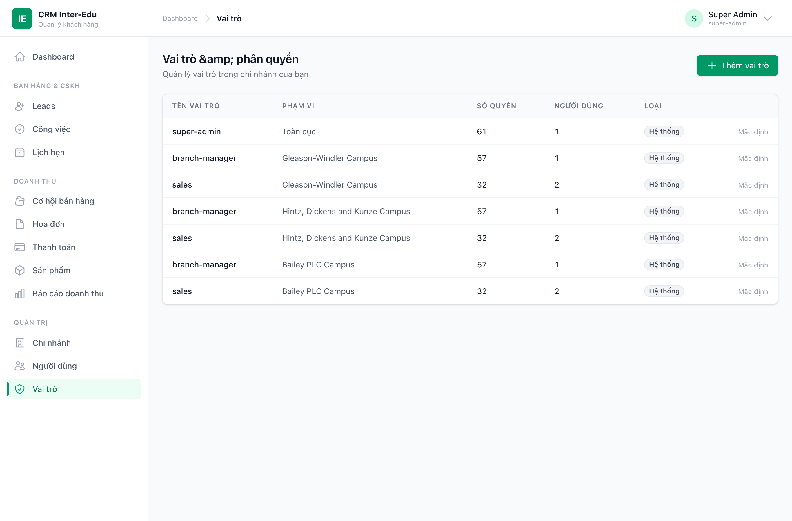{width=6.2in}

*Hình 13.6 — Danh sách vai trò*

- 3 vai trò hệ thống (**super-admin**, **branch-manager**, **sales**) được khoá, **không sửa/xoá** được.
- Bạn có thể tạo thêm vai trò tuỳ chỉnh (ví dụ "Tư vấn viên").

**Thêm vai trò:** Bấm **+ Thêm vai trò**, đặt **Tên vai trò**, rồi **tích các quyền** theo từng module:

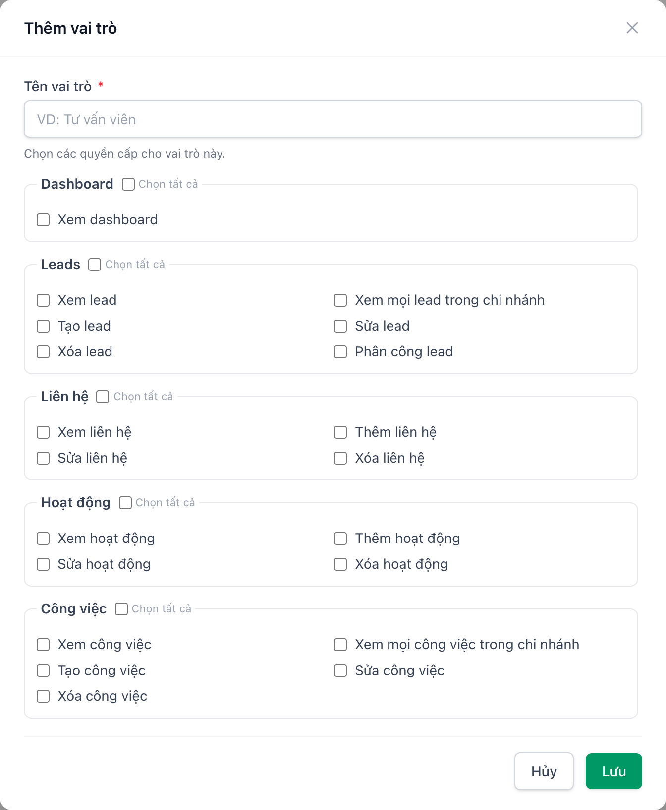{width=4.5in}

*Hình 13.7 — Cửa sổ thêm vai trò và chọn quyền*

- Quyền được nhóm theo module (Dashboard, Leads, Liên hệ, Hoạt động, Công việc...).
- Mỗi nhóm có **Chọn tất cả** để tích nhanh toàn bộ quyền của nhóm.
- Quyền dạng **"Xem mọi ... trong chi nhánh"** cho phép thấy dữ liệu của **cả chi nhánh** (không có quyền này thì chỉ thấy dữ liệu của chính mình).

Bấm **Lưu** để tạo vai trò. Sau đó vào **Người dùng** để gán vai trò mới cho nhân viên.

```{=openxml}
<w:p><w:r><w:br w:type="page"/></w:r></w:p>
```

# 14. Quy trình tổng thể (từ Lead đến thu tiền)

Sơ đồ dưới đây là trình tự làm việc khuyến nghị, kết nối toàn bộ các module:

```
1. Tạo LEAD (trường tiềm năng)            → Module 3
2. Thêm NGƯỜI LIÊN HỆ                      → Module 4
3. Ghi nhận HOẠT ĐỘNG (gọi/email/họp)     → Module 5
4. Lập CÔNG VIỆC & LỊCH HẸN theo dõi       → Module 6, 7
5. Tạo DEAL cho Lead                       → Module 9.2
6. Thêm DÒNG SẢN PHẨM vào Deal             → Module 9.3
7. Bấm THẮNG khi khách đồng ý              → Module 9.3
8. Tạo HOÁ ĐƠN từ Deal                     → Module 10.2
9. PHÁT HÀNH hoá đơn                       → Module 10.3
10. GHI NHẬN THANH TOÁN khi khách trả      → Module 11.1
11. XÁC NHẬN thanh toán                    → Module 11.2
12. Theo dõi BÁO CÁO DOANH THU             → Module 12
```

```{=openxml}
<w:p><w:r><w:br w:type="page"/></w:r></w:p>
```

# 15. Phụ lục

## 15.1. Bảng các trạng thái

**Trạng thái Lead:** Mới → Đã liên hệ → Đã lọc → Đã chào hàng → Đang đàm phán → Thắng / Mất

**Cấp học:** Mầm non · Tiểu học · THCS · THPT · Liên cấp · Khác

**Giai đoạn Deal:** Mới → Chào hàng → Đàm phán → Thắng / Mất

**Trạng thái Hoá đơn:** Nháp · Đã phát hành · Thanh toán một phần · Đã thanh toán · Quá hạn · Đã huỷ

**Phương thức thanh toán:** Chuyển khoản · Tiền mặt · Thẻ tín dụng · Ví điện tử · Khác

**Trạng thái Công việc:** Chưa làm · Đang làm · Hoàn thành · Đã huỷ — **Mức ưu tiên:** Thấp · Trung bình · Cao · Khẩn cấp

**Loại Hoạt động:** Gọi điện · Email · Họp · Ghi chú

**Trạng thái Lịch hẹn:** Đã lên lịch · Đã diễn ra · Đã huỷ — **Loại:** Họp · Gọi điện · Tại văn phòng · Trực tuyến · Khác

## 15.2. Phân quyền theo vai trò (tóm tắt)

| Chức năng | Sales | Quản lý CN | Super Admin |
|---|:---:|:---:|:---:|
| Xem/sửa dữ liệu của mình (Lead, Deal, Task...) | ✔ | ✔ | ✔ |
| Xem **mọi** dữ liệu trong chi nhánh | – | ✔ | ✔ |
| Thêm/sửa **Sản phẩm** | – | ✔ | ✔ |
| **Xoá** Deal / Huỷ hoá đơn | – | ✔ | ✔ |
| Lập & phát hành hoá đơn, ghi nhận & xác nhận thanh toán | ✔ | ✔ | ✔ |
| Quản lý **Người dùng** & **Vai trò** | – | ✔ | ✔ |
| Quản lý **Chi nhánh** | – | – | ✔ |

*(✔ = có quyền, – = không có quyền. Vai trò tuỳ chỉnh có thể được cấp quyền khác đi.)*

## 15.3. Câu hỏi thường gặp (FAQ)

**Hỏi: Tôi không thấy một nút/menu được nhắc trong tài liệu?**
Đáp: Vai trò của bạn chưa được cấp quyền đó. Liên hệ Quản lý chi nhánh hoặc Super Admin.

**Hỏi: Tôi chỉ thấy dữ liệu của mình, không thấy của đồng nghiệp?**
Đáp: Đúng theo thiết kế. Cần quyền *"Xem mọi ... trong chi nhánh"* mới thấy toàn bộ.

**Hỏi: Đang nhập liệu thì hiện thông báo "Phiên làm việc đã hết hạn"?**
Đáp: Do để màn hình mở quá lâu hoặc hệ thống khởi động lại. Trang sẽ tự tải lại; hãy **đăng nhập lại** rồi nhập lại biểu mẫu.

**Hỏi: Bấm Lưu nhưng có ô bị báo đỏ?**
Đáp: Ô đó nhập thiếu hoặc sai. Đọc dòng chữ đỏ dưới ô để sửa, rồi bấm **Lưu** lại.

**Hỏi: Lỡ tay xoá dữ liệu thì sao?**
Đáp: Thao tác **Xoá không khôi phục được**. Hãy cân nhắc kỹ; nếu cần khôi phục, liên hệ bộ phận kỹ thuật.

**Hỏi: Tạo Deal nhưng không thấy Lead trong danh sách chọn?**
Đáp: Vì **mỗi Lead chỉ có một Deal**. Lead đã có deal sẽ không hiện lại; hãy mở deal cũ của Lead đó.

---

*Tài liệu hướng dẫn sử dụng — Hệ thống CRM Inter-Edu.*
